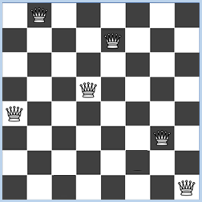

####################################
Retour sur trace (Backtracking)
####################################

.. warning::

   Les codes présentés dans cette section diffèrent légèrement de ceux présents
   dans le `chapitre original
   <http://www.tigerjython.ch/franz/index.php?inhalt_links=navigation.inc.php&inhalt_mitte=effizienz/backtracking.inc.php>`_
   de *TigerJython* et en corrigent quelques erreurs, comme le fait d'utiliser
   une variable ``sum`` qui écrase la fonction intégrée ``sum`` de Python, ce
   qui est une mauvaise pratique considérée comme une erreur par les versions
   récentes de l'environnement TigerJython.

Introduction
============

Dans le domaine du développement de jeu vidéo, les choses commencent à devenir
intéressantes lorsque l’ordinateur devient lui-même un joueur présentant une
certaine intelligence. Un tel programme doit non seulement se conformer aux
règles du jeu mais également poursuivre une stratégie de victoire. Afin
d’implémenter une stratégie de jeu, il faut voir le jeu comme une séquence de
situations pouvant être clairement identifiés à l’aide d’une variable appropriée
``s``. Ces situations sont appelées **états du jeu**, raison pour laquelle la
variable ``s`` est appelée **variable d’état**. La stratégie gagnante consiste à
passer de l’état initial à un état gagnant dans lequel le jeu est terminé.

On peut se représenter les états du jeu comme des **nœuds** dans le
**graphe de jeu**. À chaque tour de jeu, il y a une transition qui se fait entre le nœud
actuel et l’un de ses successeurs. Les règles du jeu spécifient quels sont les
**nœuds successeurs** possibles pour l’état actuel, également appelés nœuds voisins
du nœud actuel. On peut représenter cette transition par une ligne orientée
(flèche), également appelée **arête orientée**.

.. sidebar:: Info

   La théorie des jeux est basée sur la théorie des graphes qui constitue un
   domaine spécifique des mathématiques discrètes.

Dans cette section, nous allons aborder des techniques importantes qui sont
valables de manière générale et qui vous aideront à développer des jeux vidéo
capables de gagner même contre des joueurs humains très intelligents. Il vous
restera cependant encore beaucoup de liberté et d’occasions pour développer vos
propres idées ainsi que des stratégies de jeu plus efficaces, plus simples et
mieux adaptées qui permettront d’améliorer le jeu encore davantage ou de
consommer moins de puissance de calcul.

De plus, il est un fait que de nombreux systèmes politiques, économiques ou
sociaux peuvent être compris et modélisés comme des jeux, ce qui vous permettra
d’appliquer les notions abordées ci-après dans un panel très large de domaines
particulièrement pertinents.

.. admonition:: Concepts de programmation
   :class: tip

   *  État de jeu
   *  Graphe de jeu
   *  Recherche en profondeur d'abord
   *  Retour sur trace (backtracking)

Recherche d'une solution pour un jeu en solitaire
=================================================

.. sidebar:: Arbre

   Un arbre est un graphe dépourvu de cycle

Comme nous l’avons vu précédemment, on peut représenter les états de jeu comme
des nœuds dans un graphe qui est parcouru pas à pas. Il faut commencer par
déterminer de manière unique les états du jeu selon certains critères tels que
l’arrangement des pièces sur le plateau de jeu. Les règles du jeu spécifient
quels sont les successeurs (ou voisins) possibles d’un état du jeu particulier.
Ces nœuds sont alors reliés dans le graphe par une arête. Puisqu’il s’agit
d’états successeurs, les arêtes sont orientées en partant du nœud représentant
l’état actuel vers ses successeurs. Un nœud est parfois appelé « père » et ses
voisins des « fils » et il est possible qu’il y ait une arête orientée partant
de fils pour remonter au père. Prenons d’abord un graphe simple issu d’un jeu se
jouant en solo ou par une seule personne contre l’ordinateur. Le jeu en
solitaire devrait être conçu de telle sorte qu’il ne soit pas possible de
revenir à un état antérieur. Cela garantit que le graphe est exempt de cycle
dans lequel on pourrait tourner en rond à l’infini en traversant le graphe. Un
tel cas particulier de graphe est appelé **arbre**. On peut identifier
les nœuds dans n’importe quel ordre par des nombres compris entre 0 et 17. Le
graphe présente la structure suivante :

   Arbre de jeu

Il faut pouvoir stocker l’arbre en entier dans une structure de données
appropriée. Une bonne idée est d’utiliser une liste dont chaque élément d’indice
i est une sous-liste comprenant les nœuds fils du nœud ``i``. Ainsi, les fils du
nœud 0 se trouveront dans la sous-liste placée à la position 0, les fils du nœud
1 figureront dans la sous-liste placée à la position 1, etc … Si un nœud ne
possède pas de fils, la liste des nœuds fils correspondante sera vide. Un tel
noeud est appelé **feuille de l'arbre**.

L’arbre illustré ci-dessus peut donc être représenté par la liste suivante:

::

   neighbours = [
      [4, 1, 16], [2, 5, 7], [], [], [9, 13],[11, 14], [], [], [17, 6, 3],
      [], [], [], [], [10, 12], [], [], [15, 8], []
   ]

.. sidebar:: Parcours récursif d'un arbre

   Les arbres étant des structures récursives, il est très facile de les
   parcourir récursivement. En effet, un sous-arbre est lui-même un arbre.

Le fait d’identifier un nœud par un nombre est une astuce qui permet de
déterminer facilement ses nœuds fils au sein de la liste grâce à l’indice.
L’algorithme permettant de trouver le chemin pour passer d’un nœud à un autre
nœud placé plus en profondeur dans l’arbre est défini récursivement dans la
fonction ``search(node)``. Voici sa formulation en **pseudo code** :

::

  search(node):
     if node == targetnode:
          print "Target achieved"
          return
     Déterminer la liste neighbors des voisins de node
     parcourir cette liste et faire pour chacune:
          search(neighbors)

.. sidebar:: Utilisation d'une pile pour la liste ``visited``

   La liste ``visited`` présente donc une structure LIFO (Last In First Out) de
   **pile** (*stack* en anglais)

De plus, les nœuds visités sont ajoutés à la fin de la liste ``visited``. Si l’état
visé n’est pas atteint avant, le dernier nœud ajouté à la liste ``visited`` en est
supprimé après que tous ses fils ont été visités. Cela permet de restaurer
l’état en vigueur avant la visite infructueuse de ce nœud. Le nœud de
départ et d’arrivée peuvent être saisis au début de l’exécution du programme.

.. raw:: html

   

.. code-block:: python
   :linenos:

   neighbours = [
      [4, 1, 16], [2, 5, 7], [], [], [9, 13], [11, 14], [], [],
      [17, 6, 3], [], [], [], [], [10, 12], [], [], [15, 8], []
   ]

   def search(node):
       visited.append(node) # put (push) to stack

       # Check for solution
       if node == targetNode:
           print "Target ", targetNode, "achieved. Path:", visited
           targetFound = True
           return

       for neighbour in neighbours[node]:
           search(neighbour) # recursive call
       visited.pop() # redraw (pop) from stack

   startNode = -1
   while startNode < 0 or startNode > 17:
      startNode = inputInt("Start node (0..17):")
   targetNode = -1
   while targetNode < 0 or targetNode > 17:
      targetNode = inputInt("Target node (0..17):")
   visited = []
   search(startNode)

.. admonition:: Memento
   :class: warning

   Le chemin correct ``[0, 1, 5, 14]`` pour le nœud de départ 0 et le nœud cible 14
   est imprimé dans la sortie standard. Si l’on rajoute le nœud 0 comme voisin du
   nœud 13, on introduit un cycle dans le graphe et il en résulte une situation
   catastrophique par laquelle le programme se termine avec une exception indiquant
   que la profondeur maximale de récursion a été atteinte.

Parcours en profondeur d'abord
==============================

.. admonition:: Info
   :class: tip

   Cette section est une reprise de la section "Traversée d'un alien" de
   TigerJython
   (http://www.tigerjython.ch/franz/index.php?inhalt_links=navigation.inc.php&inhalt_mitte=effizienz/backtracking.inc.php)"

Il serait agréable de pouvoir visualiser l’exécution de l’algorithme en
représentant graphiquement l’arbre de décision du jeu et en le traversant
progressivement au fur et à mesure du déroulement en pressant sur une touche.
Pour ce faire, utilisons une fenêtre ``GameGrid`` dans laquelle les nœuds de l’arbre
sont représentés par un cercle placé au milieu d’une cellule de la grille
(coordonnées grille / grid location).

Traversée de l'alien
--------------------

Un alien semi-transparent met en évidence l’état courant du jeu.

   Parcours d'un arbre en profondeur d'abord

On dessine l’arbre en utilisant les méthodes graphiques de la classe
``GGBackground``. Pour montrer la direction des arêtes, il est possible
d’ajouter un petit cercle aux arêtes en lieu et place d’une pointe de flèche en
utilisant la méthode ``getMarkerPoint()``. Il faut alors s’assurer de rafraîchir
l’écran avec ``refresh()``. La barre d’état montre des informations importantes.

.. tip::

   Dans le code ci-dessous, étudier surtout la fonction ``search()``!

.. code-block:: python
   :linenos:

   from gamegrid import *

   neighbours = [
      [4, 1, 16], [2, 5, 7], [], [], [9, 13], [11, 14], [], [],
      [17, 6, 3], [], [], [], [], [10, 12], [], [], [15, 8], []
   ]

   locations = [Location(x, y) for x, y in [
      (6, 0), (6, 1), (4, 2), (13, 3), (1, 1), (6, 2), (12, 3), (8, 2), (12, 2),
      (0, 2), (1, 3), (5, 3), (3, 3), (2, 2), (7, 3), (10, 2), (11, 1), (11, 3)
   ]]

   # pas nécessaire d'étudier cette fonction en détails. N'est là que dans un
   # but de démonstration
   def drawGraph():
       getBg().clear()
       for i in range(len(locations)):
           getBg().setPaintColor(Color.lightGray)
           getBg().fillCircle(toPoint(locations[i]), 6)
           getBg().setPaintColor(Color.black)
           getBg().drawText(str(i), toPoint(locations[i]))
           for k in neighbours[i]:
               drawConnection(i, k)
       refresh()

   # pas nécessaire d'étudier cette fonction en détails. N'est là que dans un
   # but de démonstration
   def drawConnection(i, k):
       getBg().setPaintColor(Color.gray)
       startPoint = toPoint(locations[i])
       endPoint = toPoint(locations[k])
       getBg().drawLine(startPoint, endPoint)
       getBg().fillCircle(getMarkerPoint(endPoint, startPoint, 10), 3)

   ######################################################################
   ### >>>>>>>>>> Fonction à bien étudier <<<<<<<<<<<<<<<<<<<
   ######################################################################
   def search(node):
       global targetFound
       if targetFound:
           return
       visited.append(node) # put (push) to stack
       alien.setLocation(locations[node])
       refresh()
       if node == targetNode:
           setStatusText("Target " + str(targetNode) + "achieved. Path: "
                         + str(visited))
           targetFound = True
           return
       else:
           setStatusText("Current node " + str(node) + " .  Visited: "
           + str(visited))
       getKeyCodeWait(True) # exit if GameGrid is disposed

       for neighbour in neighbours[node]:
           search(neighbour)  # Recursive call
       visited.pop()

   ######################################################################
   ### Programme principal
   ######################################################################

   makeGameGrid(14, 4, 50, Color.red, False)
   setTitle("Tree-traversal (depth-first search). Press a key...")
   addStatusBar(30)
   show()
   setBgColor(Color.white)
   drawGraph()

   startNode = -1
   while startNode < 0 or startNode > 17:
      startNode = inputInt("Start node  (0..17):")
   targetNode = -1
   while targetNode < 0 or targetNode > 17:
      targetNode = inputInt("Target node  (0..17):")

   visited = []
   targetFound = False
   alien = Actor("sprites/alieng_trans.png")
   addActor(alien, locations[startNode])

   search(startNode)
   setTitle("Tree-traversal (depth-first search). Target achieved")

.. admonition:: Memento
   :class: warning

   Comme vous pouvez le constater, l’alien se déplace vers les nœuds fils « en
   profondeur d’abord » et remonte au dernier nœud parent lorsque tous les fils ont
   été visités. C’est pour cette raison que cet algorithme s’appelle « recherche en
   profondeur avec retour sur trace ». (depth-first search with backtracking).

L'alien sur le chemin du retour
===============================

Afin de rendre visible le chemin emprunté par l’alien lors de son retour sur
trace, il est nécessaire de sauvegarder la séquence des nœuds visités lors du
parcours en profondeur. Le passage à chaque niveau de profondeur supplémentaire
engendre une nouvelle liste que l’on sauvegarde dans ``stepsList``. Après avoir
effectué un retour sur trace, il faut supprimer la dernière entrée de cette
liste avec ``stepsList.pop()``.

.. tip::

   Dans le code ci-dessous, étudier surtout la fonction ``search()``!

.. code-block:: python
   :linenos:

   from gamegrid import *

   neighbours = [
      [4, 1, 16], [2, 5, 7], [], [], [9, 13], [11, 14], [], [],
      [17, 6, 3], [], [], [], [], [10, 12], [], [], [15, 8], []
   ]

   locations = [Location(x, y) for x, y in [
    (6, 0), (6, 1), (4, 2), (13, 3), (1, 1), (6, 2), (12, 3), (8, 2), (12, 2),
    (0, 2), (1, 3), (5, 3), (3, 3), (2, 2), (7, 3), (10, 2), (11, 1), (11, 3)
   ]]

   def drawGraph():
       getBg().clear()
       for i in range(len(locations)):
           getBg().setPaintColor(Color.lightGray)
           getBg().fillCircle(toPoint(locations[i]), 6)
           getBg().setPaintColor(Color.black)
           getBg().drawText(str(i), toPoint(locations[i]))
           for k in neighbours[i]:
               drawConnection(i, k)
       refresh()

   def drawConnection(i, k):
       getBg().setPaintColor(Color.gray)
       startPoint = toPoint(locations[i])
       endPoint = toPoint(locations[k])
       getBg().drawLine(startPoint, endPoint)
       getBg().fillCircle(getMarkerPoint(endPoint, startPoint, 10), 3)

   def search(node):
      '''

      Le paramètre ``node`` est un nombre indiquant la position du noeud dans la
      liste des noeuds

      '''
       global targetFound
       if targetFound:
           return
       visited.append(node) # put (push) to stack
       alien.setLocation(locations[node])
       refresh()
       if node == targetNode:
           setStatusText("Target " + str(targetNode) + "achieved. Path: "
                         + str(visited))
           targetFound = True
           return
       else:
           setStatusText("Current nodes " + str(node) + " .  Visited: "
                         + str(visited))
       getKeyCodeWait(True) # exit if GameGrid is disposed

       for neighbour in neighbours[node]:
           steps = [node]
           stepsList.append(steps)
           steps.append(neighbour)
           search(neighbour)  # Recursive call
           steps.reverse()
           if not targetFound:
               for loc in steps[1:]:
                   setStatusText("Go back")
                   alien.setLocation(locations[loc])
                   refresh()
                   getKeyCodeWait()
           stepsList.pop()
       visited.pop()

   makeGameGrid(14, 4, 50, Color.red, False)
   setTitle("Tree-traversal (depth-first search). Press a key...")
   addStatusBar(30)
   show()
   setBgColor(Color.white)
   drawGraph()

   startNode = -1
   while startNode < 0 or startNode > 17:
      startNode = inputInt("Start node  (0..17):")
   targetNode = -1
   while targetNode < 0 or targetNode > 17:
      targetNode = inputInt("Target node (0..17):")

   visited = []
   stepsList = []
   targetFound = False
   alien = Actor("sprites/alieng_trans.png")
   addActor(alien, locations[startNode])

   search(startNode)
   setTitle("Tree-traversal (depth-first search). Target  achieved")

.. admonition:: Compréhension de la fonction ``search()``
   :class: note

   #. Expliquer le fonctionnement des lignes 8 à 11 et expliquer son avantage par rapport au `code original <http://www.tigerjython.ch/franz/index.php?inhalt_links=navigation.inc.php&inhalt_mitte=effizienz/backtracking.inc.php>`_ de *TigerJython* ci-dessous :

      ::

         locations = [Location(6, 0), Location(6, 1), Location(4, 2), Location(13, 3),
             Location(1, 1), Location(6, 2), Location(12, 3), Location(8, 2),
             Location(12, 2), Location(0, 2), Location(1, 3), Location(5, 3),
             Location(3, 3), Location(2, 2), Location(7, 3), Location(10, 2),
             Location(11, 1), Location(11, 3)]

   #. Pourquoi la liste globale ``stepsList`` n'est-elle pas déclarée comme
      ``global`` alors qu'elle est modifiée au sein de la fonction ``search`` (ligne 58)?

   #. Pourquoi faut-il inverser la liste ``steps`` à la ligne 61 ?

   #. Exécuter le code de ce programme dans le débogueur en mode pas à pas pour
      comprendre le fonctionnement de la fonction ``search`` et l'ordre dans
      lequel les noeuds sont visités.

   #. Que fait l'instruction ``stepsList.pop()`` à la ligne 68 et pourquoi est-elle nécessaire?

   #. À quoi correspond l'élément qui est retiré de la liste ``visited`` avec ``visited.pop()`` à la ligne 69 ?

.. admonition:: Memento
   :class: warning

   À présent, l’alien revient véritablement sur ses traces dans l’arbre, ce qui
   rend particulièrement évident le fait que cet algorithme s’appelle retour sur
   trace (*backtracking*). Le retour sur trace récursif joue un rôle très important
   dans de nombreux algorithmes, à tel point qu’il est parfois considéré comme « le
   couteau suisse du programmeur ».

Stratégie dans un labyrinthe
============================

Il est parfois très difficile, voire même angoissant, de parvenir à trouver le
chemin menant à la sortie d’un labyrinthe. Heureusement, grâce à vos
connaissances sur le retour sur trace, vous êtes maintenant en mesure d’écrire
un programme capable de trouver la sortie à tous les coups pour autant que
celle-ci existe. Il est relativement évident qu’il est possible de modéliser un
labyrinthe ne possédant pas de cycle par un arbre. Il apparaît donc que de
trouver la sortie d’un tel labyrinthe correspond en fait à traverser un arbre.

Dans le cas présent, nous allons nous contenter d’un petit labyrinthe aléatoire
de :math:`11 \times 11` cellules. L’alien se déplace d’une seule étape à chaque
pression d’une touche du clavier mais recherche directement la sortie de manière
autonome lors d’une pression sur la touche :kbd:`Enter`.

.. sidebar:: Illustration du parcours du labyrinthe

   .. figure:: figures/eff3d.png
      :align: center

      Parcours du labyrinthe en profondeur d'abord

Parcours du labyrinthe en profondeur d'abord
Le labyrinthe est généré à l’aide de la classe ``Maze`` dont le constructeur prend
en argument des entiers impairs représentant le nombre de lignes et de colonnes
désirées. À chaque fois, la classe génère un labyrinthe aléatoire différent dont
l’entrée se trouve en haut à gauche et la sortie en bas à droite. La méthode
``isWall(loc)`` permet de tester si la position ``loc`` correspond à un mur.

Il n’est souvent pas souhaitable de déterminer le graphe de jeu complet avant le
début du jeu. Très souvent, cela est même impossible puisqu’il y aurait tant de
situations à prévoir qu’il faudrait un temps CPU et un stockage dans la RAM
complètement démesurés. De ce fait, il est souvent préférable de ne déterminer
les nœuds fils du nœud courant que lors du parcours de l’arbre.

En l’occurrence, on détermine les nœuds voisins du nœud actuel en sélectionnant
les cellules adjacentes (au maximum 4) qui ne sont pas des murs et qui ne se
situent pas en dehors de la grille.

.. code-block:: python
   :linenos:

   from gamegrid import *

   def createMaze():
       global maze
       maze = GGMaze(11, 11)
       for x in range(11):
           for y in range(11):
               loc = Location(x, y)
               if maze.isWall(loc):
                   getBg().fillCell(loc, Color(0, 50, 0))
               else:
                   getBg().fillCell(loc, Color(255, 228, 196))
       refresh()

   def getNeighbours(node):
       neighbours = []
       for loc in node.getNeighbourLocations(0.5):
           if isInGrid(loc) and not maze.isWall(loc):
              neighbours.append(loc)
       return neighbours

   def search(node):
       global targetFound, manual
       if targetFound:
           return
       visited.append(node)  # push
       alien.setLocation(node)
       refresh()
       delay(500)
       if manual:
           if getKeyCodeWait(True) == 10:  #Enter
               setTitle("Finding target...")
               manual = False

       # Check for termination
       if node == exitLocation:
           targetFound = True

       for neighbour in getNeighbours(node):
           if neighbour not in visited:
               backSteps = [node]
               backStepsList.append(backSteps)
               backSteps.append(neighbour)

               search(neighbour) # recursive call

               backSteps.reverse()
               if not targetFound:
                   for loc in backSteps[1:]:
                       setTitle("Must go back...")
                       alien.setLocation(loc)
                       refresh()
                       delay(500)
                   if manual:
                       setTitle("Went back. Press key...")
                   else:
                       setTitle("Went back. Find target...")
               backStepsList.pop()
       visited.pop() # pop

   manual = True
   targetFound = False
   visited = []
   backStepsList = []
   makeGameGrid(11, 11, 40, False)
   setTitle("Press a key. (<Enter> for automatic")
   show()
   createMaze()
   startLocation = maze.getStartLocation()
   exitLocation = maze.getExitLocation()
   alien = Actor("sprites/alieng.png")
   addActor(alien, startLocation)
   search(startLocation)
   setTitle("Target found")

.. admonition:: Memento : Humain vs Ordinateur
   :class: warning

   Il est intéressant de comparer la stratégie de résolution d’un humain avec
   celle de l’ordinateur. Un joueur humain est capable de saisir la situation
   d’ensemble en un coup d’œil et d’en déduire une stratégie permettant de
   trouver la sortie de manière très directe. Il utilise pour cela une aptitude
   de vision globale caractéristique de l’humain dont l’ordinateur est
   totalement dépourvu. L’ordinateur, quant à lui, ne possède qu’une vision très
   locale de la situation en lien avec sa position actuelle mais il a l’avantage
   de « se souvenir » exactement de tous les chemins déjà empruntés et peut donc
   chercher de manière très systématique de nouveaux chemins jusqu’à tomber
   fatalement sur celui qui le mènera à la sortie.

   L’humain est donc favorisé s’il possède une vue d’avion du labyrinthe mais le
   vent tourne en faveur de l’ordinateur si l’humain est lui-même restreint à
   une vision locale en se trouvant dans le labyrinthe, pour autant que les murs
   soient trop haut pour qu’il puisse voir « au-delà » du couloir actuel.

Exercices
=========

#. Dans un arbre binaire, chaque nœud possède exactement deux nœuds fils, à
   savoir un nœud gauche et un nœud droit. Représentons chacun des nœuds par une
   liste de deux entiers ``[m,n]`` où ``m`` symbolise la profondeur du nœud au
   sein de l’arbre et ``n`` sa position en largeur.

   Développer un programme qui écrit le chemin permettant de passer d’un nœud
   initial à un nœud final.

   .. figure:: figures/effA3_1.png
      :align: center
      :width: 80%

      Chemin d'un noeud initial à un noeud final

#. Il est remarquable qu’il soit toujours possible de trouver la sortie d’un
   labyrinthe en utilisant la règle de la main droite, même lorsque le labyrinthe
   comporte des cycles. Cette règle consiste à suivre scrupuleusement le mur avec
   la main droite en observant les règles suivantes :

   *  Si la cellule à droite de la cellule actuelle est libre (pas de mur), bouger vers cette cellule
   *  Si ce n’est pas possible (la cellule à droite est un mur), continuer tout droit
   *  Si aucune des deux premières possibilités n’est possible, tourner à gauche

   Implémenter cette règle pour le labyrinthe ``GameGrid`` en utilisant une
   coccinelle pivotable comme acteur avec

   ::

      lady = Actor(True, "sprites/ladybug.gif").

   .. admonition:: Indications
      :class: tip

      Placer la coccinelle dans la cellule selon la règle de la main
      droite en utilisant la fonction ``move()``. Si la cellule en question est un
      mur, annuler le mouvement. Comparer cette solution avec celle obtenue par
      l’algorithme de retour sur trace.

BONUS : Le problème des :math:`N` dames
=======================================

Le problème des :math:`N` dames est un problème d’échecs qui a déjà été discuté
depuis le milieu du 19e siècle. Il s’agit de placer :math:`N` dames sur un
échiquier de taille :math:`N \times N` de telle sorte qu’elles ne se menacent
pas mutuellement selon les règles habituelles des échecs qui stipulent que la
dame se peut se déplacer horizontalement, verticalement et en diagonale. Ce
problème appelle deux types de solutions dont les niveaux de difficulté sont
radicalement différents. La solution la plus facile à obtenir consiste à trouver
un placement particulier des dames qui satisfait les contraintes du problème.
L’autre type de solution, beaucoup plus difficile à atteindre, consiste à
déterminer le nombre de placements possibles. Le mathématicien Glaisher a prouvé
en 1874 déjà que le problème des :math:`N` dames comportait 92 solutions pour un
échiquier habituel, à savoir pour :math:`N=8`.

Le problème des :math:`N` dames est considéré comme un candidat classique pour la
résolution par retour sur trace. Il s’agit de placer les dames une à une sur
l’échiquier de telle sorte que chaque nouvelle dame placée ne menace aucune dame
placée précédemment. Si l’on procède de manière naïve, il y a tôt ou tard un
moment où l’on ne peut plus placer de dame. La stratégie du retour sur trace
consiste alors à supprimer la dernière dame placée pour tenter une alternative.
Si cette nouvelle tentative ne mène toujours pas à une solution, il faut encore
retirer une dame de plus et ainsi de suite, jusqu’à ce qu’une solution soit
trouvée. Un humain s’emmêlerait vite les pinceaux en perdant le contrôle des
solutions déjà testées mais l’ordinateur ne souffre pas de ce problème car il
procède de manière purement mécanique et méthodique.

De même que pour toute situation à traiter par retour sur trace, on peut
considérer les états de jeu comme des nœuds dans le graphe de jeu. Il est à cet
effet crucial de choisir une structure de données appropriée. Procéder par la
force brute en testant toutes les façons possibles de placer les :math:`N` dames
sur l’échiquier et en rejetant celles où les dames s’attaquent mutuellement est
totalement impensable. En effet, lorsque :math:`N` vaut seulement 8, il y a déjà
environ 422 millions placements possibles à tester.

   Problème des :math:`N` dames de taille :math:`8 \times 8`

Il serait bien plus malin de ne considérer dès le début que des positions dans
lesquelles chaque dame se trouve seule sur sa colonne et sa rangée. À ce
dessein, pour :math:`N=8`, on peut représenter l’état du jeu en se contentant
d’une liste de 8 nombres dont l’élément :math:`i` représente la position de la
dame :math:`i` dans la rangée :math:`i`. Les lignes dépourvues de dame sont
représentées par le nombre :math:`-1`. En utilisant des indices de ligne et de
colonne compris entre :math:`0` et :math:`n-1`, le placement représenté
ci-contre serait représenté par la liste

::

   node = [1, 4, -1, 3, 0, 6, -1, 7]

On peut déterminer les noeuds voisins du nœud actuel (node) au sein de
l’algorithme de retour sur trace à l’aide de la fonction
``getNeighbours(node)``. On passe de ce fait d’une structure de données
unidimensionnelle à la liste Locations qui utilise les coordonnées :math:`x` et
:math:`y` des cases de l’échiquier. Les cases déjà occupées sont référencées
dans la liste squares et celles qui ne peuvent pas être utilisées en vertu des
règles des échecs dans la liste ``forbidden``. Il est à cet effet utile de
recourir à la méthode ``getDiagonalLocations()``. Finalement, on crée la liste
``allowed`` pour stocker les cases qui peuvent encore recevoir une dame. Il faut à
ce stade remplacer le :math:`-1` dans la liste des nœuds voisins par l’indice de
la colonne sur laquelle la nouvelle dame a été placée.

L’algorithme de retour sur trace maintenant bien connu est implémenté dans la
fonction ``search()``. Dès qu’une solution a été trouvée, la recherche par retour
sur trace est arrêtée (condition d’arrêt de la récursion).

.. code-block:: python
   :linenos:

   from gamegrid import *

   n = 8 # number of queens

   def getNeighbours(node):
       squares = [] # list of occupied squares
       for i in range(n):
           if node[i] != -1:
              squares.append(Location(node[i], i))

       forbidden = [] # list of forbidden squares
       for location in squares:
           a = location.x
           b = location.y
           for x in range(n):
               forbidden.append(Location(x, b))  # same row
           for y in range(n):
               forbidden.append(Location(a, y))  # same column
           for loc in getDiagonalLocations(location, True):   #diagonal up
               forbidden.append(loc)
           for loc in getDiagonalLocations(location, False):  #diagonal down
               forbidden.append(loc)

       allowed = [] # list of all allowed squares = all - forbidden
       for i in range(n):
           for k in range(n):
               loc = Location(i, k)
               if not loc in forbidden:
                   allowed.append(loc)

       neighbourNodes = []
       for loc in allowed:
           neighbourNode = node[:]
           i = loc.y # row
           k = loc.x # col
           neighbourNode[i] = k
           neighbourNodes.append(neighbourNode)
       return neighbourNodes

   def search(node):
       global found
       if found or isDisposed():
           return
       visited.append(node)  # node marked as visited

       # Check for solution
       if not -1 in node:
           found = True
           drawNode(node)

       for s in getNeighbours(node):
           search(s)
       visited.pop()

   def drawBoard():
       for i in range(n):
           for k in range(n):
               if (i + k) % 2 == 0:
                   getBg().fillCell(Location(i, k), Color.white)

   def drawNode(node):
       removeAllActors()
       for i in range(n):
           addActorNoRefresh(Actor("sprites/chesswhite_1.png"), Location(node[i], i))
       refresh()

   makeGameGrid(n, n, 600 // n, False)
   setBgColor(Color.darkGray)
   drawBoard()
   show()
   setTitle("Searching. Please wait..." )

   visited = []
   found = False
   startNode = [-1] * n  # all squares empty
   search(startNode)
   setTitle("Search complete. ")

.. admonition:: Memento
   :class: warning

   Suivant les performances de votre ordinateur, la solution devrait émerger en
   quelques secondes ou en quelques minutes. Si l’exécution est trop lente, il
   suffit de réduire la taille du problème en posant :math:`N=6`.

Exercices
=========

#. Résoudre la même tâche sans utiliser la bibliothèque ``GameGrid``. Remplacer
   les objets ``Location`` par une liste de listes ``[i, k]`` représentant la
   position de la case dans l’échiquier. La solution peut être imprimée dans la
   console comme une liste de nœuds.

#. Généraliser le programme réalisé précédemment pour :math:`N = 6` ou votre propre
   programme de l’exercice 1 pour qu’il trouve toutes les solutions possibles.
   Remarquez que certains nœuds reviennent à plusieurs reprises (symétries et
   rotations de l’échiquier). Éviter les doublons en maintenant une liste de
   solutions déjà trouvées.

#. BONUS : Expliquer en quoi le programme de résolution des :math:`N` dames présenté
   n'est pas très efficace. Proposer une meilleure implémentation de la même
   stratégie.

#. Expliquer ce qu'est un algorithme heuristique et résoudre le problème des :math:`N`
   dames en utilisant une méthode heuristique.
