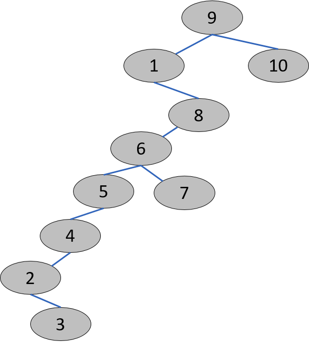
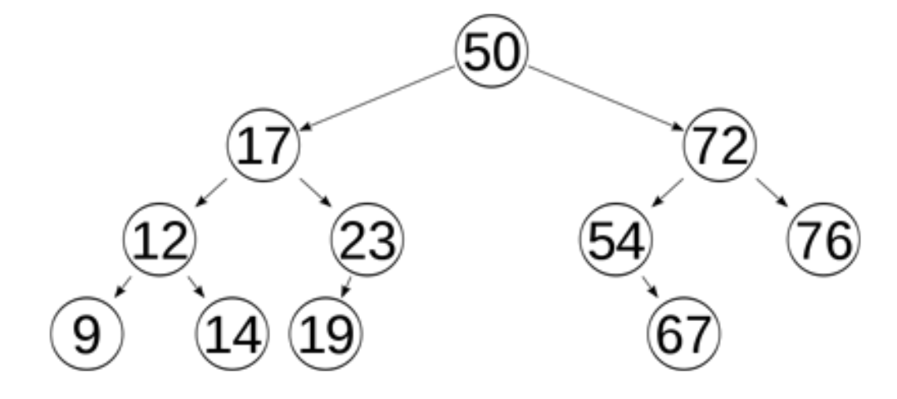
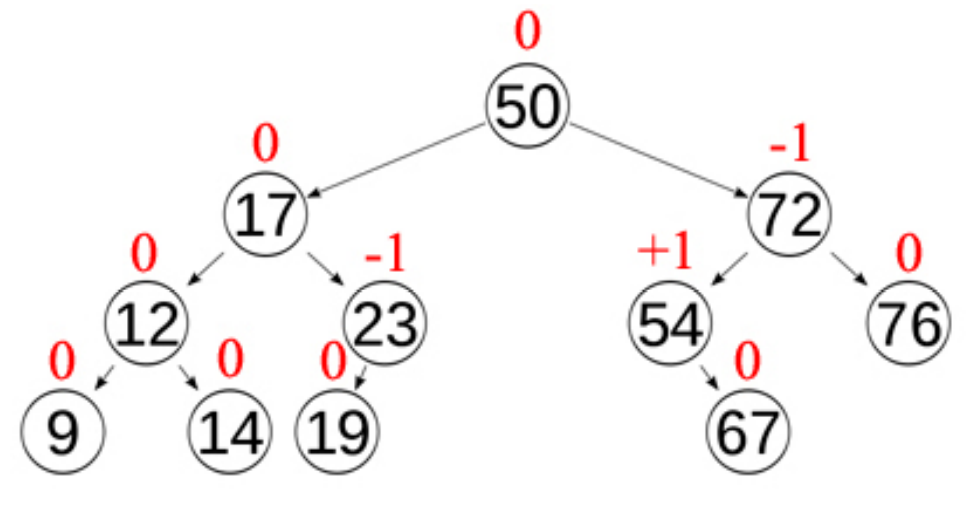
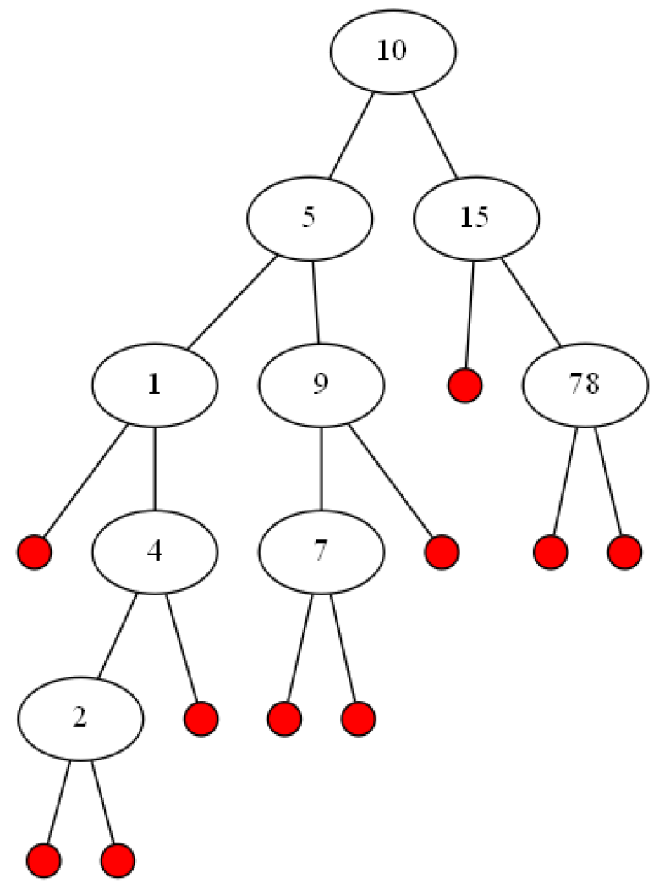
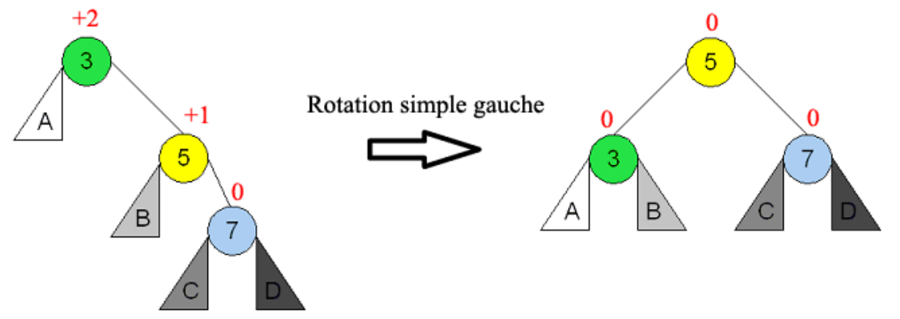
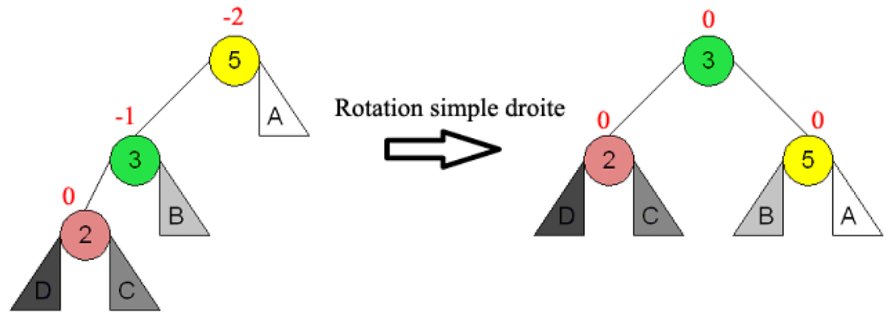
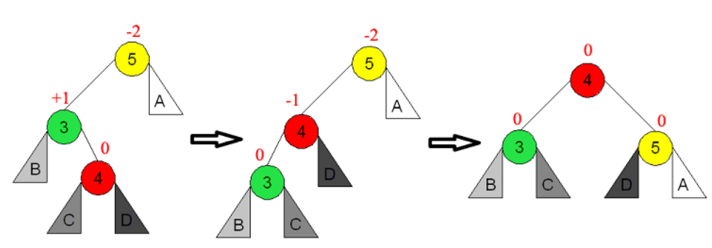
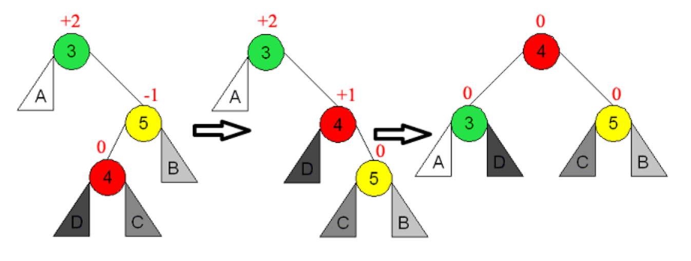

##############
Arbres AVL
##############

.. admonition:: Source
   :class: tip

   Les informations et les illustrations de cette section sont principalement
   tirées du cours http://www.apprendre-en-ligne.net/info/structures/index.html,
   plus préciséement le PDF
   http://www.apprendre-en-ligne.net/info/structures/structures.pdf

Introduction
============

Les arbres binaires de recherche présentent le désavantage de devenir rapidement
déséquilibrés si les clés sont insérées dans un ordre « trop croissant » ou «
décroissant ». En pratique, ce cas pathologique est très fréquent car l'on
rencontre plus fréquemment des données comportant une certaine structure que des
données  ordonnées de manière parfaitement aléatoires. On a de ce fait recours à
des techniques d’équilibrage des ABR.

   Exemple d'arbre binaire déséquilibré suite à l'insertion des clés ``[9, 1, 8, 6, 10, 5, 4, 7, 2, 3]``

Les arbres AVL constituent historiquement l'une des premières méthodes
d’autoéquilibrage des ABR. Elle fut inventée par deux russes, Georgy Maximovich
Adelson-Velsky et Evgenii Mikhailovich Landis, qui l'ont publiée en 1962 sous le
titre *An algorithm for the organization of information*.

Dans un arbre AVL, les hauteurs des deux sous-arbres d'un même nœud diffèrent au
plus de un. La recherche, l'insertion et la suppression sont toutes en
:math:`\mathcal{O}(\log(n))` dans le pire des cas.

   Exemple d'arbre binaire équilibré

Le facteur d'équilibrage d'un nœud est la différence entre la hauteur de son
sous-arbre droit et celle de son sous-arbre gauche. Un nœud dont le facteur
d'équilibrage est +1, 0, ou -1 est considéré comme équilibré.

   Exemple d'arbre binaire équilibré

Un nœud avec tout autre facteur est considéré comme déséquilibré et requiert un
rééquilibrage. Chaque fois qu'un nœud est inséré ou supprimé d'un arbre AVL, le
facteur d'équilibrage de chaque nœud le long du chemin depuis la racine jusqu'au
nœud inséré (ou supprimé) doit être recalculé.

Si l'arbre est resté équilibré, il n'y a rien à faire. Si ce n'est
pas le cas, on effectuera des rotations d'équilibrage de manière à
obtenir à nouveau un arbre AVL.

Exercice 1 (facteur d'équilibrage)
==========

Pour chaque noeud de l'arbre ci-dessous, déterminer

a) La hauteur de son sous-arbre gauche et de son sous-arbre droit
b) Le facteur d'équilibrage de chacun de ses noeuds

Opérations de rotation
======================

Rotation gauche
---------------

On effectue une **rotation gauche** lorsque un nœud a un facteur d'équilibrage
supérieur à +1 et que son fils droit a un facteur d'équilibrage de +1.

   Opération de rotation gauche

Rotation droite
---------------

De manière symétrique, on effectue une **rotation droite** lorsque un nœud a un
facteur d'équilibrage inflérieur à -1 et que son fils gauche a un facteur
d'équilibrage de -1.

   Opération de rotation gauche

Rotation gauche-droite
---------------

Une **rotation gauche-droite** est utilisée quand un nœud a un facteur d'équilibrage
inférieur à -1 et que son fils gauche a un facteur d'équilibrage de +1. Il
s'agit en fait d'une rotation gauche du sous-arbre gauche, suivie d'une
rotation droite du nœud déséquilibré.

   Opération de rotation gauche

Rotation droite-gauche
---------------

Une **rotation droite-gauche** est utilisée quand un nœud a un facteur d'équilibrage
supérieur à +1 et que son fils gauche a un facteur d'équilibrage de -1. Il
s'agit en fait d'une rotation roite du sous-arbre droit, suivie d'une
rotation gauche du nœud déséquilibré.

   Opération de rotation gauche

.. admonition:: Visualisation des opérations
   :class: tip

   Le site https://www.cs.usfca.edu/~galles/visualization/AVLtree.html permet de
   visualiser de manière très clair les opérations d'insertion et de suppression
   en illustrant les éléments suivants

   *  Facteur d'équilibre
   *  Les opérations de rotation
   *  Insertion et suppression d'éléments

Exercice 2
=========

.. admonition:: sources

   Cet exercice est tiré du cours http://deptinfo.cnam.fr/Enseignement/CycleA/SD/

On considère la liste aléatoire suivante de 15 éléments :

::

   [25, 60, 35, 10, 5, 20, 65, 45, 70, 40, 50, 55, 30, 15]

a) Insérer ces éléments dans l'ordre de la liste dans un arbre AVL vide. Prenez la peine de bien expliquez bien le raisonnement effectué à chaque étape

b) Afficher les éléments de cet arbre en adoptant un parcours infixé.
   Quelle propriété possède la liste des éléments ainsi parcourus ? Ceci est-il toujours le cas ?

c) Supprimer le noeud 45 puis le noeud 30 de l'arbre AVL ci-dessous

   .. figure:: figures/exo-01.png
      :align: center
      :width: 50%

.. comment:: arbres avl de l'exercice

   http://www.webgraphviz.com/

   digraph G{
      graph [ordering="out"];
      null0 [shape="point"]
      null1 [shape="point"]
      null2 [shape="point"]
      null3 [shape="point"]
      null4 [shape="point"]
      null5 [shape="point"]
      null6 [shape="point"]
      null7 [shape="point"]
      null8 [shape="point"]
      null9 [shape="point"]
      null10 [shape="point"]
      null11 [shape="point"]
      null12 [shape="point"]
      40 -> 15;
      40 -> 50;
      15 -> 10;
      15 -> 30;
      10 -> 5;
      10 -> null0;
      5 -> null1;
      5 -> null2;
      30 -> 20;
      30 -> 35;
      20 -> null3;
      20 -> 25;
      25 -> null4;
      25 -> null5;
      35 -> null6;
      35 -> null7;
      50 -> 45;
      45 -> null8;
      45 -> null9;
      50 -> 60;
      60 -> 55;
      55 -> null10;
      55 -> null11;
      60 -> null12;
   }

   .. admonition:: Information

      Le corrigé de l'exercice se trouve en fin de cette section

Exercice 3
==========

Soit :math:`T` un arbre AVL de :math:`n` sommets. Chaque sommet contient une
valeur, un champ d’équilibre, deux pointeurs vers les fils gauche et droite.
Quel champs devrait-on y ajouter pour trouver le :math:`k`-ième plus petit
élément de :math:`T` en :math:`\mathcal{O}(\log n)`. Écrire cet algorithme.

Exercice 4
==========

Montrer par récurrence que l’opération de suppression dans un arbre AVL de
hauteur :math:`h` peut générer jusqu’à :math:`\left\lfloor{\frac{h}{2}} \right \rfloor`
rotations.

Implémentation d'un AVL
=======================

.. admonition:: Avertissement
   :class: attention

   La partie "implémentation" est en cours de rédaction et va encore subir de
   nombreux ajouts.

.. admonition:: Éléments à prendre en compte pour l'implémentation
   :class: tip

   Pour implémenter un AVL, il faut

   *  Modifier la classe ``TreeNode`` qui représente les noeuds et y ajouter une
      donnée supplémentaire qui permet de maintenir à tout instant son facteur d'équilibre

   *  Implémenter les opérations ``rot_left``, ``rot_right``, ``rot_left_right`` et ``rot_right_left`` qui permettent d'effectuer les quatre rotations nécessaires à son rééquilibrage

   *  Invoquer rééquilibrer l'arbre de manière judicieuse lors de chaque insertion ou suppression s'il se trouve un noeud avec un facteur d'équilibrage différent de -1, 0 ou 1

   *  Lors de l'insertion ou de la suppression, il faut veiller à mettre à jour les facteurs d'équilibres des sous-arbres dans lesquels le noeud a été inséré ou supprimé

Solution de l'exercice de compréhension sur les arbres AVL
==========================================================

Exercice 1 (facteur d'équilibrage)
----------

Ce corrigé n'est pas encore disponible.

Exercice 2 (opérations sur les arbres AVL)
----------

Les AVL sont d’abord des arbres de recherche, ils sont donc tels que tout
nœud a une clé supérieure à celles des nœuds de son sous arbre gauche et
inférieure à celles des nœuds de son sous arbre droit. De plus ils sont H-
équilibrés, donc tels que en tout nœud, la différence de hauteur entre les sous
arbres gauche et droit est au plus de 1.

L'insertion est d’abord une insertion comme feuille dans l’arbre binaire
de recherche. Ensuite, il faut remonter le chemin depuis cette feuille jusqu’à
la racine pour corriger les déséquilibres. On ajoute 1 si on remonte depuis la
gauche et on retranche 1 si on remonte depuis la droite. Si l'un d'eux devient
:math:`\pm 2`, on pratique une rotation « ad hoc ». On arrête la remontée si le
déséquilibre est nul, puisque cela implique que la hauteur de ce sous arbre n'a
pas changée.

A) Insertion des éléments
+++++++++++++++++++++++++

.. admonition:: Conseil
   :class: tip

   Utiliser la visualisation disponible sur le site
   https://www.cs.usfca.edu/~galles/visualization/AVLtree.html pour visualiser
   l'insertion des éléments ainsi que les opérations de rotation à effectuer.

   Voici le résultat auquel on arrive en utilisant cet outil :

   .. figure:: figures/solution-exo-2.png
      :align: center

      Arbre AVL résultant de l'insertion des clés

Il est essentiel de maintenir en permanence les facteurs d'équilibrage des nœuds
de l’arbre au fur et à mesure des adjonctions. Si on ne le fait pas, on risque
de ne pas faire les corrections aux bons endroits. L’adjonction de 35 implique
une rdg en 25. Celle de 5 implique une rd en 25. Celle de 20 une rgd en 35.
Celle de 65 une rg en 35. Celle de 40 une rdg en 35. Celle de 50 une rdg en 25.
Celle de 55 une rg en 45.

B) Parcours infixé
++++++++++++++++++

Comme cela a été vu pour l’exercice sur les arbres binaires de recherche, la
liste infixée d’un AVL est une liste ordonnée. N’oublions pas qu’un AVL est
d’abord un arbre binaire de recherche.

C) Suppression des noeuds 45 puis 30
++++++++++++++++++++++++++++++++++++

.. admonition:: Conseil
   :class: tip

   Utiliser la visualisation disponible sur le site
   https://www.cs.usfca.edu/~galles/visualization/AVLtree.html pour visualiser
   l'insertion des éléments ainsi que les opérations de rotation à effectuer.

La suppression d’un nœud est d’abord une suppression dans un arbre binaire
de recherche : localisation du nœud, s’il a deux fils remplacement de la
valeur par celle qui est à l’extrémité du bord gauche du sous arbre droit et le
nœud à supprimer est alors ce nœud extrémité, et enfin suppression du nœud
(initial ou extrémité) qui a au plus un fils en mettant le sous arbre restant à sa
place. Ensuite, on remonte le chemin depuis le nœud supprimé jusqu’à la
racine en corrigeant les déséquilibres. On retranche 1 si on remonte depuis la
gauche et on ajoute 1 si on remonte depuis la droite. Si l'un d'eux devient ±2,
on pratique une rotation "ad hoc". On arrête la remontée si le déséquilibre est
différent de 0, puisque cela implique que la hauteur de ce sous arbre n'a pas
changée. Notons qu’il peut y avoir plusieurs rotations à effectuer.

La suppression de 45 conduit à un déséquilibre –2 sur 50, et donc une rdg sur
ce nœud. Cette rotation conduisant à diminuer la hauteur de l’arbre
correspondant (le déséquilibre est nul), il faut poursuivre les corrections au
delà, ce qui conduit à un déséquilibre +2 sur 40, et donc une rgd sur ce
nœud.

La suppression de 30 conduit à son remplacement par 35, et la suppression
du nœud où était 35. Le déséquilibre de 40 devient –2, nécessitant une rg en
40.
