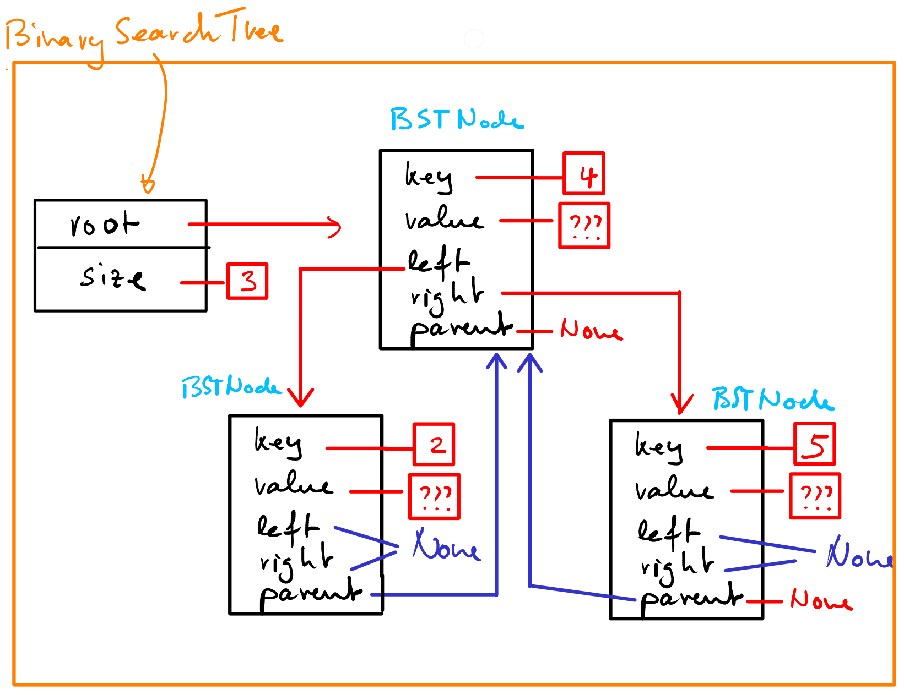

##############
Arbres binaires de recherche (Binary Search Trees)
##############

Introduction
============

Nous avons vu que la recherche par dichotomie dans un tableau trié était très
efficace vu que la complexité de la recherche d'un élément est logarithmique. Le
problème de la recherche dichotomique dans les tableaux trié se situe au niveau
de l'insertion de nouveaux éléments dans le tableau. Cette insertion est
malheureusement en :math:`\mathcal{O}(n)` puisqu'il faut placer l'élément au bon
endroit dans le tableau pour qu'il demeure trié après l'insertion.

Pour pouvoir néanmoins utiliser une recherche efficace dans les situations qui
impliquent de nombreuses insertions, il est nécessaire de développer une
structure de données plus dynamique que les tableaux qui permette de conserver
l'ordre des éléments. Les **arbres binaires de recherche** (binary search tree)
présentent une telle structure.

Fonctionnement d'un arbre binaire de recherche
==============================================

.. admonition:: Définition
   :class: important

   Un arbre binaire de recherche (ABR) est un arbre présentant les propriétés
   suivantes :

   *  Chaque noeud de l'arbre possède au plus deux fils : le fils gauche et le fils droit
   *  Tous les noeuds du sous-arbre gauche sont inférieurs à sa racine
   *  Tous les noeuds du sous-arbre droit sont supérieurs à sa racine
   *  Les sous-arbres gauche et droit sont également des arbres binaires de recherche

   Exemple d'arbre binaire de recherche

Représentation des ABR
======================

Pour implémenter les ABR en Python, nous allons utiliser définir les classes

*  ``BinarySearchTree`` pour représenter l'arbre dans son ensemble
*  ``BSTNode`` pour représenter les noeuds qui constituent cet arbre

.. comment::
   La classe ``BSTNode`` représente les noeuds individuels de l'arbre et contient
   la valeur à y stocker (``self.value``) ainsi que la clé d'accès à l'élément
   (``self.key``) qui doit supporter les opérateurs de comparaison et sur la base
   de laquelle la propriété d'arbre binaire de recherche doit être vérifiée en
   permanence. Chaque noeud maintient donc une référence au fils gauche et au fils
   droit (sous-arbre gauche et sous-arbre droit). De plus, chaque noeud maintient
   une référence ``self.parent`` à son parent, ce qui permettra notamment de
   remonter d'un fils vers son parent.

le code suivant montre comment la classe ``BSTNode`` représente un noeud de
l'ABR :

.. literalinclude:: scripts/bst.py
   :pyobject: BSTNode
   :linenos:

La classe ``BinarySearchTree`` ne contient essentiellement que deux variables
d'instance : une référence vers la racine de l'arbre (``self.root``) et le
nombre de noeuds présents dans l'arbre (``self.size``) :

.. code-block:: python

   class BinarySearchTree(object):
       """
       Implementation for Binary Search Trees
       """
       def __init__(self):
           self.root = None
           self.size = 0

On peut donc représenter l'ABR

de la manière suivante à l'aide des deux classes ``BinarySearchTree`` et
``BSTNode`` :

.. sidebar:: Visualisation Python Tutor

   .. figure:: figures/simple-BST-example-repr-python-tutor.png
      :align: center
      :width: 95%

      Visualisation obtenue à l'aide de `Python Tutor <http://tinyurl.com/gozejez>`_

On peut également utiliser l'outil Python Tutor pour visualiser l'exécution du
programme suivant ainsi que la structure des données en mémoire :

::

   keys = [4,2,5]
   bst = BinarySearchTree()
   for x in keys:
       bst.insert(x, x)

.. raw:: html

   

Opérations sur les ABR
======================

Recherche
---------

Le but premier des ABR est de pouvoir y trouver très facilement et rapidement
n'importe quel élément sur la base de sa clé d'accès. L'algorithme est très
simple et suit de près la logique de la recherche dichotomique.

Pour chercher la clé 6 dans l'ABR ci-dessous, on procède comme suit :

#. On compare la clé à chercher (6) avec la racine de l'arbre (8)
#. Comme 6 < 8, on poursuit la recherche dans le sous-arbre de gauche
#. On compare avec la racine du sous-arbre de gauche (3)
#. Comme 6 > 3, on poursuit la recherche dans le sous-arbre de droite
#. On compare avec la racine du sous-arbre de droit de (3) et on tombe sur la clé cherchée

   Recherche de la clé 6 dans l'ABR : on parcourt l'ABR depuis la racine jusqu'à
   ce que l'on tombe sur le noeud qui possède la clé recherchée

.. admonition:: Remarque
   :class: tip

   Il est possible que la clé ne soit pas présente dans l'arbre. Dans ce cas,
   la recherche va se terminer sur une des feuilles de l'arbre sans avoir
   trouvé le noeud cherché. Nous verrons que c'est à cet endroit précis qu'il
   faudrait insérer le noeud en question.

   Par exemple, si l'on cherche le noeud de clé 5 qui ne se trouve pas dans
   l'ABR, la recherche se terminerait au sous-arbre droit (``None``) du noeud de
   clé 4, car c'est à cet endroit qu'il devrait se trouver et nulle part
   ailleurs.

Insertion d'un élément
----------------------

Comme vu précédemment, il suffit, pour insérer un nouvel élément de

*  Rechercher le noeud possédant la clé que l'on veut insérer
*  S'il est déjà présent dans l'arbre, il ne faut pas insérer un nouveau noeud mais remplacer son contenu par le nouveau contenu
*  S'il n'est pas présent dans l'arbre, il faut l'insérer à l'endroit même où la recherche s'est terminée

.. admonition:: Exemple
   :class: tip

   Insérons les clés suivantes dans l'ordre 8 - 3 - 10 - 1 avec le code

   ::

      bst = BinarySearchTree()
      for k in [8, 3, 10, 1]:
         bst.insert(k, k)

   L'arbre aura alors la forme suivante

   .. figure:: figures/insertion-8-3-10-1.png
      :align: center
      :width: 80%

      Insertion des clés ``[8, 3, 10, 1]`` dans l'ordre

   Si l'on insère encore les clés ``[6, 4, 7, 14, 13]`` avec

   ::

      for k in [6, 4, 7, 14, 13]:
         bst.insert(k, k)

   on va obtenir l'arbre suivant

   .. figure:: figures/insertion-all.png
      :align: center

      Arbre obtenu après l'insertion des clés ``[8, 3, 10, 1, 6, 4, 7, 14, 13]``
      dans l'ordre

.. admonition:: Remarque importante : ordre d'insertion
   :class: warning

   Il est très important de noter que l'ordre de l'insertion des noeuds est très
   significatif pour la forme finale de l'arbre. Pour vous en convaincre,
   essayez par exemple d'introduire les noeuds dans les ordres suivants
   (solutions en find de page) :

   *  ``[13, 7, 1, 6, 3, 10, 14, 8, 4]``
   *  ``[1, 3, 4, 6, 7, 8, 10, 13, 14]``
   *  ``[14, 13, 10, 8, 7, 6, 4, 3, 1]``

Suppression d'un élémentation
-----------------------------

Le plus difficile est de supprimer les noeuds d'un ARB. Fondamentalement, il
faut distinguer trois cas à traiter séparément :

*  Le noeud est une feuille et n'a pas de fils. La suppression est triviale dans ce cas
*  Le noeud ne possède qu'un seul fils et la suppression n'est pas trop compliquée
*  Il s'agit d'un noeud intérieur qui possède deux noeuds fils. Dans ce cas, la suppression est une jolie prise de tête qui nécessite passablement de code ...

Cas 1 : le noeud n'a pas de fils
++++++++++++++++++++++++++++++++++++++

Dans le premier cas, la suppression est évidente puisqu'il s'agit d'une feuille
de l'arbre : il suffit de supprimer le noeud en question en le remplaçant par un
sous-arbre vide (``None``).

.. figure:: figures/bst_delete_0.png
   :align: center

   Suppression du noeud 1 qui est une feuille (pas de fils)

Cas 2 : le noeud n'a qu'un seul fils
++++++++++++++++++++++++++++++++++++++

Si le noeud ne possède qu'un seul fils, il suffit de supprimer le noeud en
question et de rattacher son unique fils à la place qu'il occupait comme fils de
son parent.

.. figure:: figures/bst_delete_1.png
   :align: center

   Suppression du noeud 14 qui possède un seul fils

Cas 2 : le noeud possède deux fils
++++++++++++++++++++++++++++++++++++++

S'il s'agit d'un noeud intérieur possédant deux fils, il le remplacer par son
successeur qui est l'élément minimal de son sous-arbre droit. Il s'agit bien
entendu de la feuille qui se trouve le plus à gauche dans son sous-arbre droit.
Ainsi, pour supprimer le noeud 3 qui possède deux fils, il faut le remplacer par
son successeur qui est la feuille la plus à gauche de son sous-arbre de droit
(le noeud 4).

.. figure:: figures/bst_delete_2.png
   :align: center

   Suppression du noeud 3 qui possède deux fils.

Implémentation des opérations
=============================

Recherche d'un noeud à partir de sa clé : méthode ``search(key)``
---------------------------------------

Méthode ``find_recursive(key)``
++++++++++++++++++++++++++

La méthode ``BinarySearchTree.find_recursive`` effectue une recherche récursive :

.. literalinclude:: scripts/bst.py
   :pyobject: BinarySearchTree.find_recursive
   :language: python
   :linenos:
   :prepend: class BinarySearchTree(object):
                 ...

.. admonition:: Remarque
   :class: tip

   Si la clé n'est pas trouvée lors de la recherche, la fonction
   ``find_recursive`` retourne la valeur ``None`` (lignes 10-11)

Méthode ``find_iterative(key)``
++++++++++++++++++++++++++

La méthode ``BinarySearchTree.find_iterative`` effectue une recherche itérative,
de ce fait plus efficace, toujours selon le même principe :

.. literalinclude:: scripts/bst.py
   :pyobject: BinarySearchTree.find_iterative
   :language: python
   :linenos:
   :prepend: class BinarySearchTree(object):
                 ...

Insertion d'un élément : ``BinarySearchTree.insert(key, value)``
-----------------------

Pour insérer un élément dans l'ABR, il suffit de chercher l'élément en question.
Si l'élément est déjà présent dans l'arbre, il ne faut pas réinsérer un deuxième
élément avec la même clé car on veut éviter les doublons difficiles à gérer. Si
l'élément n'est pas présent dans l'arbre, il faut l'insérer à l'endroit
(feuille) exact où la recherche s'est terminée sans succès.

.. literalinclude:: scripts/bst.py
   :pyobject: BinarySearchTree.insert
   :language: python
   :linenos:
   :prepend: class BinarySearchTree(object):
                 ...

Suppression d'un éléments : ``BinarySearchTree.delete(key)``
-------------------------

Pour supprimer un élément, il faut plusieurs méthodes qui permettent de traiter
les différents cas de figure et d'isoler les bouts de codes compliqués. Ceci
améliore la testabilité de la classe et rend le code plus compréhensible. Il
s'agit des méthodes suivantes

.. literalinclude:: scripts/bst.py
   :pyobject: BinarySearchTree.delete
   :language: python
   :linenos:
   :prepend: class BinarySearchTree(object):
                 ...

.. literalinclude:: scripts/bst.py
   :pyobject: BinarySearchTree.remove_node
   :language: python
   :linenos:

.. literalinclude:: scripts/bst.py
   :pyobject: BinarySearchTree.replace_node
   :language: python
   :linenos:

Étude du code
==============

Le code complet de cette implémentation de l'ABR est téléchargeable sur le lien
suivant : :download:`scripts/bst.py`.

Pour faciliter l'étude du code et le comprendre de manière appronfondie, il est
recommandé d'utiliser l'outil en ligne *Python Tutor* (http://pythontutor.com/)
afin de visualiser l'exécution du code lors de l'insertion, de la recherche et
de la suppression des éléments. Il est recommandé également d'imprimer le code
et de l'annoter sur une version papier.

Le Python Tutor http://tinyurl.com/hfvjvph permet d'exécuter le code pas à pas
pour visualiser son l'exécution de l'insertion, puis de la suppression de tous
les noeuds dans un ordre aléatoire. Chaque exécution engendrera donc une
visualisation différente mais l'arbre finira toujours par être vide (``bst.root ==
None``).

Tests unitaire
==============

Pour la petite histoire, le code étudié dans ce chapitre provient de la page
http://www.cs.uml.edu/~jlu1/doc/source/report/BinarySearchTree1.html. Ce code
comporte néanmoins un bogue qu'il n'a été possible de détecter qu'avec une suite
de tests unitaire présentée ci-dessous. Ce fichier doit se situer dans le même
dossier que le script ``bst.py`` présenté plus haut.

.. literalinclude:: scripts/bst_test.py
   :language: python
   :linenos:
   :caption: Tests unitaires de la classe ``BinarySearchTree``

Implémentation alternative
==========================

Voici une implémentation alternative de l'ABR dans laquelle le noeud vers le
parent n'est pas explicitement stocké dans les noeuds. Il faut en revanche
modifier légèrement la recherche en utilisant la méthode ``__find_min`` et
``__find_and_parent`` retournent le noeud cherché ainsi que son parent.

.. admonition:: Source
   :class: tip

   Cette implémentation provient de https://www.cs.umd.edu/class/spring2008/cmsc420/bst.py

.. literalinclude:: scripts/bst_implicit_parent.py
   :language: python
   :linenos:
   :caption: Implémentation de l'ABR avec un lien implicite vers le parent (méthodes ``__find_min`` et ``__find_and_parent``)

Matériel à télécharger
======================

Le code présenté dans chapitre est téléchargeable sous

*  :download:`scripts/bst.py` pour l'implémentation de l'ABR
*  :download:`scripts/bst_test.py` pour les tests unitaires garantissant le bon fonctionnement de la classe
*  :download:`scripts/bst_implicit_parent.py` implémentation alternative dans laquelle le lien vers le parent n'est pas explicitement stocké dans les noeuds
*  https://www.dropbox.com/s/ykshs985rz2m5vn/etude-code-bst.pdf?dl=0 : version papier des deux codes pour faciliter l'étude
*  :download:`files/exercices-donnee.pdf` : dossier d'exercices

Solutions
=========

Ordre d'insertion
-----------------

L'ordre d'insertion des éléments va fortement déterminer la forme (et
l'efficacité !!!) de l'arbre. Moins l'arbre est équilibré, le plus on va se
rapprocher d'une complexité linéaire au niveau de la recherche, pour perdre tous
les bénéfices de l'ABR dans le cas extrême d'un ordre d'insertion dans l'ordre
croissant ou décroissant:

   Influence de l'ordre d'insertion des clés dans l'ABR
