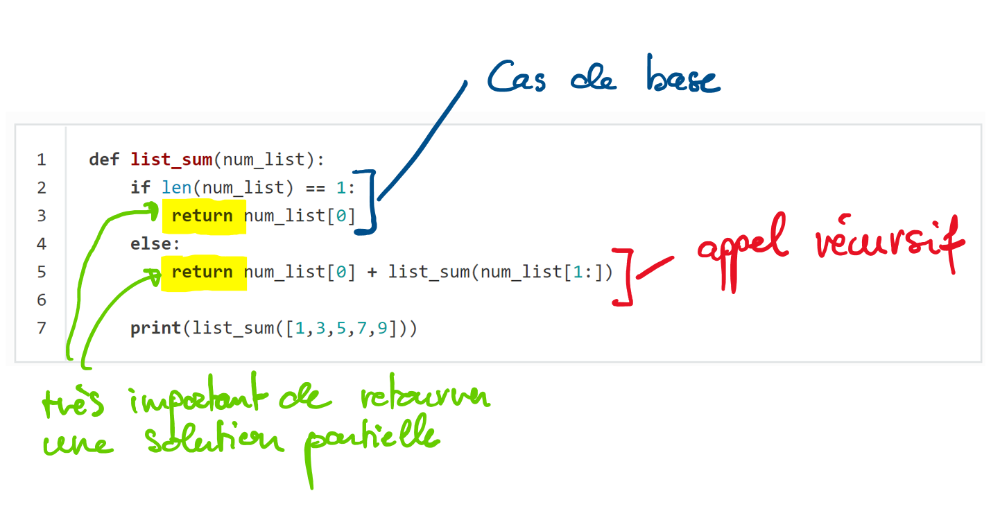

#####################
Algorithmes récursifs
#####################

Introduction
============

La récursion est une méthode de résolution de problèmes qui consiste à
décomposer un problème en sous-problèmes de plus en plus petits jusqu'à ce qu'il
se réduise à un problème suffisamment petit pour qu'il puisse être résolu de
façon triviale. Habituellement, la récursion implique une fonction qui s'appelle
elle-même. Bien que cela ne semble pas grand-chose à première vue, la
récursivité permet d'écrire des solutions élégantes à des problèmes qui,
autrement, seraient très difficiles à programmer.

Illustration avec le problème des tours de Hanoï
------------------------------------------------

..  youtube:: U3nGNJTxYc4

Résumé
------

Bouger :math:`N`  disques depuis la première tige (tige A) vers la troisième
tige (tige C) peut se réduire aux trois problèmes suivants :

#.  Déplacer :math:`N-1` disques de la tige A à la tige B
#.  Déplacer le gros disque tout en bas de la tige A à la tige C
#.  Déplacer les :math:`N-1` disques de la tige B vers la tige C

Il va sans dire que l'on peut raisonner de la même manière pour déplacer les
:math:`N-1` disques de la tige A à la tige B: il suffit de réduire le problème :

#.  Déplacer :math:`N-2` disques de la tige A à la tige C
#.  Déplacer le disque qui se trouve en haut de la pile A (l'avant-dernier) vers la pile B
#.  Déplacer les :math:`N-2` disques de la tige C vers la tige B

etc ...

Au voit bien que ce processus est récursif et que l'on peut en fait définir une
fonction récursive qui va opérer les mouvements. Le cas de base
consiste à déplacer une pile de taille 1 (à savoir un seul disque), ce qui peut
se faire de manière triviale. 

Petit exercice
--------------

Utiliser le module Python fourni ci-dessous pour résoudre les tours de Hanoï en
effectuant les exercices ci-dessous.

..  admonition:: Téléchargement du code nécessaire
    :class: note

    :download:`code/hanoi.py`

Pour utiliser ce module, créer un fichier :file:`solve_hanoi.py` dans le même
dossier que le fichier :file:`hanoi.py` et importer la classe ``HanoiTowers``
dans votre programme. On peut spécifier les mouvements entre les piles à l'aide
des opérateurs surchargés ``>`` et ``<`` de la classe ``Stick``. Les paramètres
``n`` et ``speed`` du constructeur de la classe ``HanoiTowers`` permettent de
spécifier le nombre de disques sur la pile A au début du jeu (les autres piles
étant vides) ainsi que la vitesse d'exécution des mouvements (compris entre
``1`` par défaut et ``50``) :

..  literalinclude:: code/solve_hanoi.py
    :language: python
    :linenos:

..  comment::

    from hanoi import HanoiTowers

    hanoi = HanoiTowers(n=3, names=["A", "B", "C"], speed=3)

    # A, B et C sont des variables qui désignent les "piles" de disques que l'on
    # peut manipuler avec les opérateurs > et <
    [A, B, C] = hanoi.sticks_in_order()
    sleep(1)
    
    # moves to solve the game for n=3
    A > C
    A > B
    C > B
    A > C
    B > A
    B > C
    A > C
    
    print("Nombre de mouvements nécessaires : ", Stick.nb_moves)
    
    # reset game to solve for N=4
    sleep(1)
    hanoi.reset(n=4)

Consigne
++++++++

#.  Coder les mouvements pour déplacer les 4 disques de la pile A vers la pile C.

    ..  only:: corrige

        ..  admonition:: Corrigé
            :class: important

            Les mouvements sont les suivants
        
            ::

                A > B
                A > C
                B > C
                A > B
                C > A
                C > B
                A > B
                A > C
                B > C
                B > A
                C > A
                B > C
                A > B
                A > C
                B > C

#.  Combien faut-il de mouvements au minimum pour résoudre le problème pour :math:`N = 4`.

    ..  only:: corrige

        ..  admonition:: Corrigé
            :class: important

            Il faut 15 déplacements

#.  Compléter la fonction récursive ``move_disks()`` suivante pour résoudre le
    problème pour une taille :math:`N` quelconque :

    ::
        
        def move_disks(n, s_from, s_to, s_tmp):
            # compléter le code ici
            pass

    où ``s_from`` est la pile de départ, ``s_to`` la pile d'arrivée et ``s_tmp``
    la pile intermédiaire (temporaire).

    ..  admonition:: Conseil
        :class: note

        Si vous n'arrivez pas à trouver la réponse, n'hésitez pas à poser des
        questions sur slack ou vous aider de la page Wikipedia sur les tours de
        Hanoï qui montre un algorithme récursif en pseudo-code.

    ..  only:: corrige

        ..  admonition:: Corrigé
            :class: important

            La fonction permettant de résoudre le problème est bien plus simple
            que ce que pourrait laisser croire la complexité du problème
            lorsqu'on le résout à la main :

            ..  code-block:: python
                :linenos:

                def move_disks(n, s_from, s_to, s_tmp):
                    if n > 0:
                        move_disks(n-1, s_from, s_tmp, s_to)
                        s_from > s_to
                        move_disks(n-1, s_tmp, s_to, s_from)

            À l'aide de cette fonction, le problème peut donc se résoudre de la
            manière suivante si les variables ``A``, ``B`` et ``C`` désignent
            les trois tours :

            ::

                move_disks(n, A, C, B)

#.  Sans utiliser l'ordinateur, déterminer le nombre de mouvements nécessaires
    pour résoudre le problème pour :math:`N = 5`, :math:`N = 6` et :math:`N = 10`.

    ..  only:: corrige

        ..  admonition:: Corrigé
            :class: important

            Pour déplacer une pile de taille :math:`N`, il faut déplacer deux
            fois une pile de taille :math:`N-1` plus encore un disque. On a donc
            la relation de récurrence suivante pour le nombre de déplacements:

            ..  math::

                x_{n} = 
                    \begin{cases}
                    1 & \text{si $n = 1$},\\
                    2\cdot x_{n-1} + 1 & \text{si $n > 1$}
                    \end{cases}

            Ceci correspond à la suite de nombres 

            ..  math::

                1, 3, 7, 15, 31, 63, 127, 255 \ldots

            On constate que c'est presque la suite des puissances de 2 :

            ..  math::

                2, 4, 8, 16, 32, 64, 128, 256 \ldots = 2^n

            Plus précisément, c'est la suite :math:`x_n = 2^n - 1`

             ..  math::

                2, 4, 8, 16, 32, 64, 128, 256 \ldots = 2^n - 1

            On a donc, pour :math:`N = 5` 
            
            ..  math:: 
            
                x_N = 2^{N} - 1 = 2^5 -1 = 31

            et :math:`x_6 = 63` et  :math:`x_{10} = 1023`.

Calculer la somme d'une liste de nombres sans boucle
====================================================

Commençons par un problème simple que nous savons déjà résoudre sans utiliser la
récursivité :  calculer la somme d'une liste de nombres tels que :
``[1,3,5,7,9]``. Le code ci-dessous présente une fonction itérative qui fait la
somme des nombres présents dans la liste. La fonction utilise une variable
d'accumulateur (``theSum``) pour calculer un total courant de tous les nombres dans
la liste en commençant par 0 et en ajoutant chaque nombre dans la liste.

..  code-block:: python
    :linenos:

    def list_sum(num_list):
        theSum = 0
        for i in num_list:
            theSum = theSum + i
        return theSum

    print(list_sum([1,3,5,7,9]))

Imaginons qu'il n'y ait pas de boucles ``for`` ou ``while`` dans le langage
Python. Comment pourrait-on calculer la somme d'une liste de nombres ? Un
mathématicien commencerait  par se rappeler que l'addition est une fonction qui
est définie pour deux paramètres, une paire de nombres. Pour réduire le problème
de la somme d'une liste à l'addition de paires de nombres, on pourrait réécrire
la liste comme une expression entièrement parenthésée. Une telle expression
ressemble à ceci :

..  math::

    ((((1+3)+5)+7)+9)

On peut aussi parenthéser l'expression dans l'autre sens,

..  math::

    (1+(3+(5+(7+9))))

Notons que l'addition au sein de la paire de parenthèse la plus emboîtée, (7+9),
constitue un problème que nous pouvons résoudre sans boucle ni construction
spéciale. En fait, on peut utiliser la séquence suivante de simplifications
pour calculer une somme finale.

..  math::

    \mathrm{total}=(1+(3+(3+(5+(7+(7+9))))) \\
    \mathrm{total}=(1+(3+(3+(5+16))) \\
    \mathrm{total}=(1+(3+21)) \\
    \mathrm{total}=(1+24) \\
    \mathrm{total}=25

Comment prendre cette idée et la transformer en un programme Python ? Tout d'abord,
reformulons le problème de la somme en termes de listes Python. Nous pourrions
dire que la somme de la liste ``num_list`` est la somme du premier élément de la
liste (``num_list[0]``), et la somme des nombres dans le reste de la liste (``num_list[1:]``).
Sous forme fonctionnelle, cela donne :

..  math::

    \mathrm{list\_sum}(\mathrm{num\_list})=first(\mathrm{num\_list})+\mathrm{list\_sum}(rest(\mathrm{num\_list}))

Dans cette équation :math:`first(\mathrm{num\_list})` retourne le premier élément de la
liste et :math:`rest(\mathrm{num\_list})` retourne une liste de tout sauf le premier
élément. Cela s'exprime facilement en Python de la manière suivante :

..  code-block:: python
    :linenos:

    def list_sum(num_list):
        if len(num_list) == 1:
            return num_list[0]
        else:
            return num_list[0] + list_sum(num_list[1:])

        print(list_sum([1,3,5,7,9]))

Examinons les idées essentielles de ce code :

#.  Premièrement, à la ligne 2, nous
    vérifions si la liste ne contient qu'un seul élément. Ce contrôle est crucial et
    constitue notre garantie de sortie de la fonction. La somme d'une liste de
    longueur 1 est triviale.

#.  Deuxièmement, à la ligne 5, notre fonction s'appelle elle-même ! C'est la
    raison pour laquelle nous appelons l'algorithme ``list_sum`` récursif. Une fonction
    récursive est une fonction qui s'appelle elle-même.

La figure 1 montre la série d'appels récursifs qui sont nécessaires pour
additionner la liste ``[1,3,5,5,7,9]``. 

Il faut considérer cette série d'appels comme une série de simplifications. À
chaque  appel récursif, on réduit le problème à un problème plus petit, jusqu'à
ce qu'on arrive à un point où le problème ne peut plus être réduit.

..  figure:: figures/sumlistIn.png
    :align: center
    :width: 50%

    Visualisation des appels récursifs nécessaires à additionner les éléments de
    la liste

Lorsqu'on parvient au point où le problème ne peut plus être réduit, on commence
à combiner les solutions de chacun des petits problèmes jusqu'à ce que le
problème initial soit résolu. La figure :ref:`fig-sumlistOut-label` montre les ajouts effectués au fur et
à mesure que la somme de liste revient en arrière dans la série d'appels.
Lorsque la somme de liste revient du problème le plus haut, nous avons la
solution à l'ensemble du problème.

.. _fig-sumlistOut-label:

..  figure:: figures/sumlistOut.png
    :align: center
    :width: 50%

    Combinaison des solutions partielles pour réaliser la somme des éléments de
    la liste

Les trois principes de la récursion
===================================

Comme les robots d'Asimov, tous les algorithmes récursifs doivent obéir à trois
lois importantes :

#.  Un algorithme récursif doit avoir un cas de base.

#.  Un algorithme récursif doit changer son état et se rapprocher du cas de base.

#.  Un algorithme récursif doit s'appeler lui-même, récursivement.

Examinons chacun de ces principes plus en détail et voyons comment ils ont été
utilisés dans la fonction ``list_sum``. 

    Illustration des principes des algorithmes récursifs

#.  Premièrement, le cas de base est la condition qui permet à la récursion de
    s'interrompre. Un cas de base est généralement un problème suffisamment
    petit pour être résolu directement. Dans l'algorithme de la somme de liste,
    le cas de base consiste à additionner les éléments d'une liste ne comprenant
    qu'un seul élément.

#.  Pour obéir au deuxième principe, il faut effectuer un changement d'état qui
    rapproche l'algorithme du cas de base. Un changement d'état signifie que
    certaines données utilisées par l'algorithme sont modifiées. Habituellement,
    les données qui représentent notre problème deviennent plus petites. En
    l'occurrence, notre structure de données principale est une liste et il faut
    donc concentrer les  efforts de changement d'état sur cette liste. Étant
    donné que le cas de base est une liste de longueur 1, une progression
    naturelle vers le cas de base consiste à raccourcir la liste. C'est
    exactement ce qui se passe à la ligne 5 du code, lorsqu'on appelle
    ``list_sum`` avec une liste plus courte.

#.  Le troisième principe dit  que l'algorithme doit s'appeler lui-même. C'est
    la définition  même de la récursivité. La récursivité est un concept
    déroutant pour de nombreux programmeurs débutants. En tant que programmeur
    débutant, vous avez appris que les fonctions sont bonnes parce que vous
    pouvez prendre un gros problème et le diviser en petits problèmes. Les
    petits problèmes peuvent être résolus en écrivant une fonction pour résoudre
    chaque problème. Lorsque nous parlons de récursivité, il se peut que nous
    ayons l'impression de tourner en rond. Nous avons un problème à résoudre
    avec une fonction, mais cette fonction résout le problème en s'appelant
    elle-même ! Mais la logique n'est pas circulaire du tout; la logique de la
    récursion est une expression élégante de la résolution d'un problème en le
    décomposant en problèmes plus petits et plus faciles.

Dans la suite de ce chapitre, nous allons examiner d'autres exemples de
récursivité. Dans chaque cas, on se concentrera sur la recherche d'une solution
en utilisant les trois lois de la récursivité.

