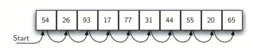

#####################################
Algorithmes élémentaires de recherche
#####################################

Présentation PowerPoint
=======================

..  raw:: html

    <iframe src="https://onedrive.live.com/embed?cid=D617C342AC226A99&resid=D617C342AC226A99%2153211&authkey=ADRld7YT1ntcKIY&em=2" width="100%" height="480" frameborder="0" scrolling="no"></iframe>

Introduction
============

Nous allons maintenant nous pencher sur certains des problèmes les plus courants
qui se posent en informatique, ceux de la recherche et du tri. Dans cette
section, nous allons étudier la recherche. Nous reviendrons au tri plus loin
dans le chapitre. La recherche est le processus algorithmique qui consiste à
trouver un élément particulier dans une collection d'éléments. Une recherche
répond généralement ``True`` ou ``False`` à la question de savoir si l'élément
est présent. À l'occasion, il peut être modifié pour retourner la position où
l'élément a été trouvé. Pour les besoins qui nous occupent ici, nous nous
occuperons simplement de la question de l'appartenance.

En Python, il existe un moyen très simple de demander si un élément se trouve
dans une liste d'éléments en utilisant l'opérateur ``in``.

::

    >>> 15 in [3,5,2,4,1]
    False
    >>> 3 in [3,5,2,4,1]
    True

Même si Python nous permet facilement de savoir si un élément se trouve dans une
collection, il est important de comprendre comment cela se fait "sous le capot".
Il s'avère qu'il existe de nombreuses manières de rechercher un élément dans une
liste. Nous sommes ici intéressés par le fonctionnement de ces algorithmes et 
comment ils se comparent les uns aux autres.

La recherche séquentielle (par balayage)
========================================

Lorsque des données sont stockées dans une collection telle qu'une liste, on dit
qu'elles entretiennent une relation linéaire ou séquentielle. Chaque élément de
données est stocké dans une position relative par rapport aux autres. Dans les
listes Python, ces positions relatives sont les valeurs d'indice des éléments.
Comme ces valeurs d'indice sont ordonnées, il nous est possible de les visiter
dans l'ordre. Ce processus donne naissance à notre première technique de
recherche : la **recherche séquentielle**.

La figure :ref:`fig_seqsearch1` illustre le fonctionnement de cette recherche. À
partir du premier élément de la liste, on passe simplement d'un élément à
l'autre, en suivant l'ordre séquentiel sous-jacent jusqu'à ce qu'on trouve
l'élément cherché ou que l'on arrive bredouille à la fin de la liste.

..  _fig_seqsearch1:

    Illustration du processus de recherche linéaire (séquentielle)

Le code ci-dessous montre une implémentation possible en Python de cet
algorithme de recherche. La fonction prend en paramètre la liste ainsi que
l'élément recherché et retourne un booléen indiquant s'il y est présent ou non.
La variable booléenne ``found`` est initialisée à ``False`` et reçoit la valeur
``True`` dès que l'on rencontre l'élément cherché dans la liste.

..  code-block:: python
    :linenos:

    def sequential_search(alist, item):
        pos = 0
        found = False

        while pos < len(alist) and not found:
            if alist[pos] == item:
                found = True
            else:
                pos = pos+1

        return found

    test_list = [1, 2, 32, 8, 17, 19, 42, 13, 0]
    print(sequential_search(test_list, 3))
    print(sequential_search(test_list, 13))

Analyse de complexité de la recherche séquentielle
--------------------------------------------------

Pour analyser les algorithmes de recherche, il faut déterminer les opérations
élémentaires nécessaires à leur exécution. En l'occurrence, il est raisonnable
de prendre en compte le nombre de comparaisons nécessaires. Chaque comparaison
peut permettre ou non de découvrir l'élément recherché. La liste des éléments
n'est en aucun cas ordonnée : ils sont donc placés au hasard dans la liste. En
d'autres termes, la probabilité que l'élément recherché se trouve dans une
position particulière est exactement la même pour chaque position de la liste.

Si l'élément n'est pas dans la liste, la seule façon de le savoir est de le
comparer à chaque élément présent. S'il y a :math:`n` éléments,  la recherche
séquentielle nécessite :math:`n` comparaisons pour découvrir que l'élément est
absent. Dans le cas où il figure dans la liste, l'analyse n'est pas aussi
simple. Il y a en fait trois scénarios différents qui peuvent se produire. Dans
le meilleur des cas, on trouve immédiatement l'élément au début de la liste et
il suffit d'une seule  comparaison. Dans le pire des cas, on ne le trouve que
lors de la toute dernière comparaison, en :math:`n`-ième position.

Qu'en est-il du cas moyen ? En moyenne, on trouve l'élément à peu près à
mi-chemin dans la liste et il faut alors le comparer à environ
:math:`\frac{n}{2}` éléments. Rappelons cependant que lorsque :math:`n` devient
grand, les coefficients, peu importe leur valeur, deviennent insignifiants dans
notre approximation. De ce fait, la complexité de la recherche séquentielle est
:math:`O(n)`.

Le tableau :ref:`tbl_seqsearchtable1` résume ces résultats.

..  _tbl_seqsearchtable1:

..  table:: **Nombre de comparaisons nécessaires pour la recherche séquentielle dans une liste non triée**

    ==================== ========================== ========================== ========================
    **Scénario**         **Meilleur cas**           **Pire cas**               **Cas moyen**
    ==================== ========================== ========================== ========================
    Élément présent      :math:`1`                  :math:`n`                  :math:`\frac{n}{2}`
    Élement absent       :math:`n`                  :math:`n`                  :math:`n`
    ==================== ========================== ========================== ========================

Jusqu'à présent, on a supposé que la liste d'éléments n'était pas triée.
Pourrait-on améliorer la recherche si la liste était triée?

Supposons que les éléments soient triés par ordre croissant. Si l'élément
recherché est présent dans la liste, la probabilité qu'il soit à l'une des
:math:`n` positions de la liste est toujours la même qu'avant. Il faudra
toujours le même nombre de comparaisons pour trouver l'élément. Toutefois, si
l'élément n'est pas pas dans la liste, il y a un léger avantage : la figure
:ref:`Figure 2 <fig_seqsearch2>` met ce phénomène en évidence lorsque
l'algorithme recherche l'élément 50. 

Les éléments sont encore comparés dans l'ordre jusqu'à 54. À ce moment,
cependant, on peut savoir quelque chose de plus qu'avant : non seulement 54
n'est pas l'élément recherché, mais il n'y a pas d'autre élément au-delà de 54
qui puisse correspondre puisque la liste est triée. Dans ce cas, l'algorithme
n'a pas besoin de continuer à parcourir la liste plus loin pour signaler que
l'élément n'a pas été trouvé et peut retourner immédiatement ``False``. Le code
:ref:`lst_seqsearchpython2` montre cette variante de la fonction de recherche
séquentielle.

..  _fig_seqsearch2:

..  figure:: Figures/seqsearch2.png
    :align: center

    Recherche linéaire dans une liste d'entiers triée

..  _lst_seqsearchpython2:

..  code-block:: python
    :caption: Recherche séquentielle dans une liste ordonnée
    :linenos:

    def ordered_sequential_search(alist, item):
        pos = 0
        found = False
        stop = False
        while pos < len(alist) and not found and not stop:
            if alist[pos] == item:
                found = True
            else:
                if alist[pos] > item:
                    stop = True
                else:
                    pos = pos+1

        return found

    test_list = [0, 1, 2, 8, 13, 17, 19, 32, 42,]
    print(ordered_sequential_search(test_list, 3))
    print(ordered_sequential_search(test_list, 13))

Le tableau :ref:`tbl_seqsearchtable2` résume ces résultats. Notez que dans le
meilleur des cas on pourrait découvrir que l'élément n'est pas dans la liste en
ne faisant qu'une seule comparaison. En moyenne, on pourra le savoir en
seulement :math:`\frac {n}{2}` comparaisons. Cependant, cette technique est
toujours de complexité linéaire, à savoir en :math:`\mathcal{O}(n)`. En résumé,
une recherche séquentielle est améliorée sur les listes ordonnées seulement si
l'élément ne se trouve pas dans la liste.

..  _tbl_seqsearchtable2:

..  table:: **Nombre de comparaisons pour une recherche séquentielle dans une liste ordonnée**

    ================ ================   ==============  ===================
                     **Meilleur cas**   **Pire cas**    **Average Case**
    ================ ================   ==============  ===================
    Élément présent  :math:`1`          :math:`n`       :math:`\frac{n}{2}`
    Élément absent   :math:`1`          :math:`n`       :math:`\frac{n}{2}`
    ================ ================   ==============  ===================

Recheche dichotomique
=====================

Présentation de l'algorithme
----------------------------

Le fait que la liste soit triée permet même encore une bien meilleure recherche
si l'on est un peu malin au niveau des comparaisons. Dans la recherche
séquentielle, lorsque l'on compare avec le premier élément, il reste au plus
:math:`n-1` éléments supplémentaires à parcourir si le premier élément n'est pas
celui qui est cherché. Au lieu de parcourir la liste de manière séquentielle,
une **recherche dichotomique** commence par examiner l'élément du milieu de la
liste. Si c'est l'élément cherché, l'algorithme est terminé. Si ce n'est pas le
cas, on peut profiter du fait que la liste est triée pour éliminer la moitié des
éléments restants. En effet, si l'élément recherché est plus grand que l'élément
du milieu, on peut éliminer tous les éléments placés avant l'élément du milieu
et se concentrer sur la deuxième moitié de la liste.

On peut ensuite répéter ce processus sur la moitié droite de la liste. La figure
:ref:`fig_binsearch` montre comment cet algorithme permet rapidement de trouver
la valeur 54. 

Voici le code complet :ref:`pour la recherche séquentielle <lst_binarysearchpy>`.

..  code-block:: python3

    def binary_search(alist, item):
        first = 0
        last = len(alist) - 1
        found = False

        while first<=last and not found:
            midpoint = (first + last) // 2
            if alist[midpoint] == item:
                found = True
            else:
                if item < alist[midpoint]:
                    last = midpoint - 1
                else:
                    first = midpoint + 1

        return found

    test_list = [0, 1, 2, 8, 13, 17, 19, 32, 42,]
    print(binary_search(test_list, 3))
    print(binary_search(test_list, 13))

Avant de passer à l'analyse, il convient de noter que cet algorithme constitue
un bel exemple de la stratégie de "diviser pour régner". Diviser pour mieux
régner signifie que l'on divise  le problème en plus petits morceaux, qu'on
résout les plus petits sous-problèmes d'une manière ou d'une autre, puis que
l'on réassemble le tout  pour obtenir le résultat du problème de départ.
Lorsqu'on  effectue une recherche binaire dans une liste, on vérifie d'abord
l'attribut l'élément du milieu. Si l'élément cherché est inférieur à celui du
milieu, on peut  simplement effectuer une recherche dichotomique dans la moitié
gauche de la liste originale. De même, si l'élément est plus grand, on peut
effectuer un recherche dichotomique dans la moitié droite. Quoi qu'il en soit,
il s'agit d'un appel récursif à la fonction fonction de ``binary_search`` sur
une liste plus petite. Le code :ref:`lst_recbinarysearch` montre
cette version récursive.

.. _lst_recbinarysearch:

..  code-block:: python3
    :linenos:

    def binary_search(alist, item):
        if len(alist) == 0:
            return False
        else:
            midpoint = len(alist) // 2
            if alist[midpoint] == item:
              return True
            else:
              if item<alist[midpoint]:
                return binary_search(alist[:midpoint], item)
              else:
                return binary_search(alist[midpoint + 1:], item)

    test_list = [0, 1, 2, 8, 13, 17, 19, 32, 42,]
    print(binary_search(test_list, 3))
    print(binary_search(test_list, 13))

Analyse de la recherche binaire
-------------------------------

Pour analyser l'algorithme de recherche dichotomique, il faut se rappeler  que
chaque étape élimine environ la moitié des éléments considérés. Quel est le
nombre maximal de comparaisons de cet algorithme ? Sera-t-il nécessaire de
vérifier toute la liste ? Si nous commençons par *n* éléments, environ
:math:`\frac{n}{2}` d'entre eux seront laissés après la première comparaison.
Après la deuxième comparaison, il en restera environ :math:`\frac{n}{4}`. Puis
:math:`\frac{n}{8}`, :math:`\frac{n}{16}`, et ainsi de suite. Combien de fois
faudra-t-il ainsi diviser la taile de la liste par deux? Le tableau :ref:`Tableau 3
<tbl_binaryanalysis>` permet de trouver la réponse.

.. _tbl_analyse_dichotomique :

... table:: **Tableau d'analyse pour une recherche dichotomique**

    ======================== ======================================  
     **# comparaisons**       **# éléments restants** 
    ======================== ====================================== 
                           1                   :math:`\frac {n}{2}` 
                           2                   :math:`\frac {n}{4}` 
                           3                   :math:`\frac {n}{8}` 
                         ...                                        
                           i                 :math:`\frac {n}{2^i}` 
    ======================== ====================================== 

Lorsque l'on partage la liste suffisamment de fois en deux, on se retrouve avec
une liste qui a composée d'un seul élément. Soit c'est l'élément que nous
recherché, soit il ne l'est pas. Quoi qu'il en soit, l'algorithme est terminé.
Il faut  *i* comparaisons pour arriver à ce stade, où :math:`\frac {n}{2^i} =1`.
Résoudre cette équation pour :math:`i`  donne :math:`i=\log n`. Le nombre
maximum de comparaisons est logarithmique par rapport au nombre d'éléments de la
liste. Par conséquent, la recherche binaire est de complexité :math:`O(\log n)`.

Une autre question d'analyse doit être abordée. Dans l'analyse récursive
ci-dessus, l'appel récursif,

``binary_search(alist[:midpoint],item)``

utilise l'opérateur de slicing pour créer la moitié gauche de la liste qui est
alors passé à l'appel récursif (de même pour la moitié droite). L'analyse que
nous avons faite plus haut suppose que l'opérateur slicing est instantané (de
complexité constante). Cependant, on sait que l'opérateur de slicing est en fait
de complexité linéaire :math:`O(k)` où :math:`k` est la taille du
slicing. Cela signifie que la recherche dichotomique à l'aide d'un slicing ne
pourra pas se faire en temps logarithmique à proprement parler. Heureusement, il
est possible d'y remédier en passant la liste avec les indices de début et de
fin lors de l'appel récursif. Les indices peuvent être calculés  comme on l'a
fait dans le code :ref:`<lst_binarysearchpy>`.

Même si une recherche dichotomique est généralement meilleure qu'une recherche
séquentielle il est important de noter que pour de petites valeurs de *n*, le
coût additionnel n'en vaut probablement pas la peine. En fait, il faudrait
toujours se demander s'il est rentable de devoir commencer par trier la liste
pour pouvoir effectuer une recherche dichotomique. S'il suffit de trier une
seule fois pour effectuer de nombreuses recherche, il faut sans doute la peine
de faire le tri et d'utiliser la recherche dichotomique. Cependant, pour les
grandes listes, trier ne serait-ce qu'une seule fois peut être si coûteux que
simplement effectuer une recherche séquentielle dès le début peut être le
meilleur choix.

Exercices
==========

#.  Utiliser les animations des deux algorithmes de recherche (linéaire et
    dichotomique) sur la page https://www.cs.usfca.edu/~galles/visualization/Search.html 

    #.  Indiquer dans la case vide l'élément que vous voulez chercher #.
        Étudier le code des algorithmes présentés en exécutant l'algorithme.
        Utiliser la visualisation pour comprendre le fonctionnement du code.

    #.  Essayer de mémoriser les éléments essentiels du code et de recoder les
        fonctions environ 30 minutes plus tard

#.  Supposons que l’on fasse une recherche linéaire.

    a)	Combien faut-il de comparaisons pour trouver la clé 18 dans la liste non
        ordonnée [15, 18, 2, 19, 18, 0, 8, 14, 19, 14]. 

    b)	Combien faut-il de comparaisons pour trouver la clé 13 dans la liste
        triée [3, 5, 6, 8, 11, 12, 14, 15, 17, 18].

#.  Déterminer le nombre maximal (pire cas) de comparaisons nécessaires pour effectuer les recherches suivantes
	
    #.  Recherche linéaire dans une liste non triée de 1573294 éléments

    #.  Recherche dichotomique dans une liste triée de  :math:`2^{16}` éléments

    #.  Recherche dichotomique dans une liste triée de :math:`10^9` éléments

    #.  Recherche dichotomique dans une liste triée de 1573294 éléments

