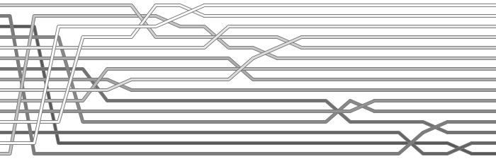

#################################
TP sur les algorithmes de tri
#################################

Introduction aux algorithmes de tri
===================================

En informatique, un algorithme de tri est une suite finie d’opérations
permettant d’organiser une collection d’objets selon un ordre déterminé. Les
objets à trier font donc partie d’un ensemble muni d’une relation d’ordre comme,
par exemple, l’ordre numérique ou lexicographique.

La principale caractéristique qui permet de différencier les algorithmes de tri
est leur complexité algorithmique. Cette analyse permet de prévoir les
ressources (i.e. la quantité de mémoire) nécessaires à l’algorithme et de
mesurer son temps d’exécution. Ce temps est calculé en estimant le nombre moyen
d’opérations exécutées pour trier un ensemble de n éléments.

En règle générale, les méthodes de tri élémentaires, comme le tri par sélection,
par insertion et par bulles, requièrent environ :math:`n^2` étapes pour trier :math:`n` éléments choisis
dans un ordre quelconque. Si n est suffisamment petit (:math:`n < 20`), ceci ne pose pas
de problème et, si les éléments sont presque ou déjà rangés, certaines de ces
méthodes se montrent souvent bien meilleures que d’autres plus complexes. Malgré
tout, rappelons que ces méthodes ne sauraient convenir pour des fichiers
aléatoires de grande taille.

Différents algorithmes de tri
-----------------------------

..  only:: html

    ..  youtube:: ZZuD6iUe3Pc

..  only:: not html

    Visualisater la vidéo Youtube
    https://www.youtube.com/watch?v=ZZuD6iUe3Pc

..  admonition:: Visualisation de nombreux algorithmes de tri
    :class: tip

    https://www.youtube.com/playlist?annotation_id=annotation_3326900649&feature=iv&list=PLZh3kxyHrVp_AcOanN_jpuQbcMVdXbqei&src_vid=kPRA0W1kECg

Objectifs
=========

Au terme de cet exercice d'exploration, chaque élève du groupe devra être
capable de:

*	Expliquer le principe de chacun des algorithmes étudiés ;
*	Appliquer à la main chacun des algorithmes étudiés à une liste d’entiers (bouts de papiers numérotés);
*	Identifier le nombre moyen d’opérations à réaliser (comparaisons / copies / swaps) pour chacun des algorithmes étudiés;
*	Implémenter en Python chacun des algorithmes étudiés sur une liste d’entiers. Les implémentations doivent être *in-place*;
* Effectuer l'analyse de complexité expérimentale de chacun des algorithmes et comparer les algorithmes entre eux

Consignes du travail
====================

Par groupes de deux, étudiez chacun des algorithmes de tri énoncés ci-dessous en
suivant les étapes ci-dessous :

1.	Etudier le principe de tri de l’algorithme à l’aide de l’exemple introductif
2.	Visualiser l’algorithme sur http://interstices.info/jcms/c_6973/les-algorithmes-de-tri
3.	Décrire à la main la progression de l’algorithme sur la liste ``[91, 17, 2, 35, 54]`` et déterminer le nombre total de comparaisons nécessaires.
4.	Testez votre algorithme avec une liste complètement mélangée, une liste décroissante, une liste croissante et une liste comprenant des doublons
5.	Implémenter l’algorithme en Python sous la forme d’une fonction prenant en paramètre la liste d’entiers à trier.
6.  Chronométrer chacun des algorithmes et compter le nombre d'opérations de comparaisons / copies / swaps pour les tailles de tableaux ``sizes`` données par

    ::

        milliers = [1, 2, 5, 10, 15, 20, 50, 100, 200, 500, 1000]
        sizes = [1000*i for i in milliers]

8.  Représenter graphiquement le temps d'exécution de chaque algorithmes en fonction de la taille de la liste à trier. Utiliser Excel à cet égard en imprimant les données dans un format approprié (CSV par exemple)

7.  Faire un rapport (Document LibreOffice) indiquant, pour chaque algorithme, sa classe de complexité sur la base ainsi que les mesures prises dans les points précédents

Les algorithmes à étudier
=========================

Tri par sélection
-----------------

..  admonition:: Consigne
    :class: tip

    Cet algorithme sera étudié en classe avec le professeur

Cette méthode de tri commence par rechercher l’élément ayant la plus petite
valeur de la liste pour l’échanger avec celui situé en première position, puis
elle recherche l’élément ayant la deuxième plus petite valeur pour l’échanger
avec celui situé en deuxième position et elle recommence ainsi jusqu’à atteindre
le dernier élément de la liste. Cette méthode porte le nom de tri par sélection
car elle procède à la « sélection » successive de l’élément minimal parmi ceux
restants, comme le montre la figure ci-dessous :

À mesure que l’indice ``i`` progresse vers la droite de la liste, les éléments
situés à sa gauche ont pris leur position définitive et la liste est triée
lorsque l’indice atteint l’extrémité droite. Remarquons que l’algorithme peut
également se dérouler en triant la liste depuis la droite, c’est-à-dire en
sélectionnant à chaque passe le prochain plus grand élément.

Visualisation dynamique
+++++++++++++++++++++++

..  only:: html

    ..  youtube:: 92BfuxHn2XE

..  only:: not html

    Visualisater la vidéo Youtube
    https://www.youtube.com/watch?v=92BfuxHn2XE&index=11

Visualisation statique
++++++++++++++++++++++

..  figure:: figures/selection-static.png

    Visualisation statique du tri par sélection (cf. https://corte.si/posts/code/visualisingsorting/index.html)

Tri par insertion
-----------------

Cette méthode, la plus utilisée lorsqu’on trie des cartes, considère les
éléments les uns après les autres en insérant chacun à sa place parmi ceux déjà
triés. Pour insérer l’élément couramment considéré, on déplace simplement les
éléments qui lui sont supérieur un cran vers la droite et on l’insère dans la
place laissée vacante, comme le montre la figure ci-dessous :

Visualisation dynamique
+++++++++++++++++++++++

..  only:: html

    ..  youtube:: 8oJS1BMKE64

..  only:: not html

    Visualisater la vidéo Youtube
    https://www.youtube.com/watch?v=8oJS1BMKE64

Visualisation statique
++++++++++++++++++++++

..  figure:: figures/insertion-static.png

    Visualisation statique du tri par insertion (cf. https://corte.si/posts/code/visualisingsorting/index.html)

Tri à bulles
------------

Cette méthode consiste à traverser plusieurs fois la liste en échangeant à
chaque passage des éléments adjacents placés dans un mauvais ordre relatif. Plus
précisément, dès que l’élément de plus grande valeur est rencontré lors de la
première traversée, il est échangé avec chacun des éléments situés à sa droite
jusqu’à ce qu’il trouve sa place définitive, à l’extrémité droite de la liste. A
la deuxième traversée, c’est l’élément ayant la deuxième plus grande valeur qui
est successivement poussé vers sa place définitive et ainsi de suite, comme
l’illustre la figure ci-dessous :

Chaque traversée permet de placer un élément à sa place définitive en commençant
par celui ayant la plus grande valeur. Dès lors, les éléments situés à droite de
l’indice ``i`` sont à leur position.

Visualisation dynamique
+++++++++++++++++++++++

..  only:: html

    ..  youtube:: Cq7SMsQBEU

..  only:: not html

    Visualisater la vidéo Youtube
    https://www.youtube.com/watch?v=Cq7SMsQBEU

Visualisation statique
++++++++++++++++++++++

..  figure:: figures/bubble-static.png

    Visualisation statique du tri à bulles (cf. https://corte.si/posts/code/visualisingsorting/index.html)

Tri rapide (Quick sort)
-----------------------

Le tri rapide est, comme son nom l'indique, un algorithme de tri très rapide et
utilisé dans la plupart des langages. Il est fondé sur le principe de la
programmation récursive "diviser pour régner" (divide and conquer).

Visualisation dynamique
+++++++++++++++++++++++

..  only:: html

    ..  youtube:: 8hEyhs3OV1w

..  only:: not html

    Visualisater la vidéo Youtube
    https://www.youtube.com/watch?v=8hEyhs3OV1w

Visualisation statique
++++++++++++++++++++++

    Visualisation statique du tri rapide (cf. https://corte.si/posts/code/visualisingsorting/index.html)
