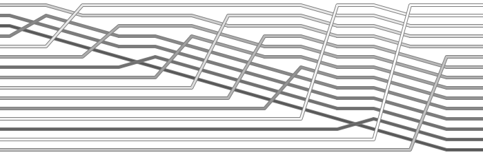

Tri par insertion
-----------------

Cette méthode, la plus utilisée lorsqu’on trie des cartes, considère les
éléments les uns après les autres en insérant chacun à sa place parmi ceux déjà
triés. Pour insérer l’élément couramment considéré, on déplace simplement les
éléments qui lui sont supérieur un cran vers la droite et on l’insère dans la
place laissée vacante, comme le montre la figure ci-dessous :

..  figure:: figures/insertion-sort-visu.png
    :width: 50%
    :align: center

Consignes
+++++++++

.. admonition:: Consigne
   :class: tip

   #. Développer une implémentation *in-place* de l'algorithme de tri par insertion dans un fichier ``insertion_sort.py``

   #. Chronométrer le temps d'exécution de l'algorithme sur des listes
      aléatoires de tailles ``sizes`` données par

      ::

        sizes = [1000, 2000, 5000, 10000, 20000]

   #. Vérifier expérimentalement la complexité temporelle de l'algorithme du tri
      fusion en représentant les mesures du point précédent dans un graphique et
      en tentant de trouver une courbe d'ajustement correspondant au nuage de
      points obtenus (utiliser l'outil *table* de https://www.desmos.com/).

   #. Prédire le temps nécessaire pour trier 25000 éléments aléatoires et vérifier cette prédiction expérimentalement.

   #. Compter expérimentalement le nombre moyen de comparaisons et de permutations
      nécessaires sur les différents types de listes et pour les tailles de listes
      ``sizes`` indiquées au point précédent

Visualisation dynamique
+++++++++++++++++++++++

..  only:: html

    ..  youtube:: 8oJS1BMKE64

..  only:: not html

    Visualiser la vidéo Youtube
    https://www.youtube.com/watch?v=8oJS1BMKE64

Visualisation statique
++++++++++++++++++++++

    Visualisation statique du tri par insertion (cf. https://corte.si/posts/code/visualisingsorting/index.html)
