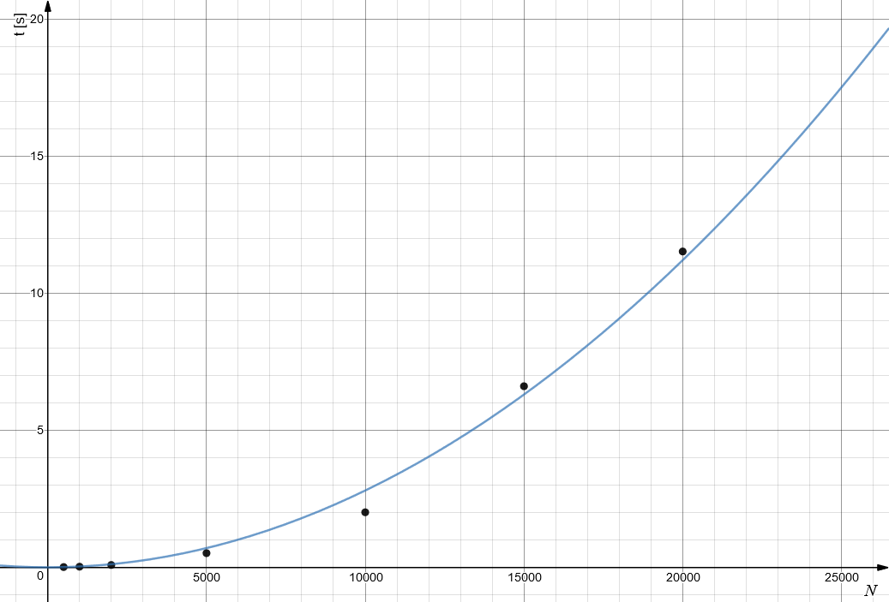

.. _sec-selection-sort-example:

#################################
Optimisation et analyse du tri par sélection
#################################

Remarques préalables : chronométrage des algorithmes
====================================================

Pour chronométrer nos algorithmes de tris (fonction prenant en paramètre une liste de
nombres à trier dans l'ordre croissant), on peut recourir au module
``benchmark.py`` dont voici le code :

.. literalinclude:: sols/benchmark.py
   :language: python
   :linenos:

Ce module est essentiellement composé des fonctions suivantes (cf. les sections
définies par des commentaires dans le code)

* La fonction ``bench`` permettant de mesurer le temps d'exécution d'un algorithme sur plusieurs tailles de listes
* Des fonctions permettant de générer aléatoirement différents types de listes de nombres

Première tentative
==================

Voici une première tentative d'algorithme de tri par sélection implémenté de
manière *out-of-place* (placement des éléments triés dans une nouvelle liste
séparée).

.. literalinclude:: sols/selection_sort_1.py
   :language: python
   :linenos:

La mesure du temps d'exécution de la fonction ``selection_sort_1`` grâce aux
instructions suivantes de la fonction ``timeit()``

::

    sizes = [500, 1000, 2000, 5000, 10000, 15000, 20000]
    report = bench(selection_sort_1, distribution=random_list_alldifferent, sizes=sizes)
    report.add_formats([FormatCSV]).report().stdout()

.. admonition:: sortie
   :class: info

   ::

      500;0.008595705032348633
      1000;0.02207207679748535
      2000;0.08450603485107422
      5000;0.5161612033843994
      10000;2.006791591644287
      15000;6.603893995285034
      20000;11.516392469406128

Ce qui correspond au tableau suivant :

.. csv-table:: Temps d'exécution de la fonction ``selection_sort_1`` sur des tableaux aléatoires de longueur différentes
   :header: "Taille de la liste", "Temps d'exécution [s]"
   :delim: ;

   500;0.008595705032348633
   1000;0.02207207679748535
   2000;0.08450603485107422
   5000;0.5161612033843994
   10000;2.006791591644287
   15000;6.603893995285034
   20000;11.516392469406128

Si l'on représente graphiquement ces données, on voit qu'elles
suivent en gros la fonction :math:`f(x)=2.8\cdot 10^{-8}\cdot x^2` :

    Mesure du temps d'exécution de ``selection_sort_1`` pour de petites listes (https://www.desmos.com/calculator/ka2cgp7aas)

..  admonition:: Remarque
    :class: tip

    Ces mesures expérimentales confirment que la complexité temporelle de tri
    par sélection est en :math:`\mathcal{O}(N^2)`.

    Cela signifie que lorsqu'on multiplie la taille de la liste à trier par 2,
    il faudra en moyenne 4 fois plus du temps pour trier les données. Si l'on
    multiplie la taille de la liste à trier par 10, il faudra :math:`10^2 = 100` fois
    plus de temps pour effectuer le tri. Ainsi, puisqu'il fallait environ :math:`2`
    secondes pour trier la liste à :math:`10'000` éléments, il faudra environ
    :math:`2 \cdot 10^2 = 200` secondes pour trier une liste de :math:`100'000` éléments, à savoir
    plus de 3 minutes.

    Ces prédictions théoriques sont confirmées dans les faits puisque, pour
    :math:`100'000` éléments, il faut environ 261 secondes :

    ::

        >>> bench(selection_sort_1, distribution=random_list_alldifferent, sizes=[100000], output="screen")
        N = 100000 : time 261,64948415756226 seconds

..  admonition:: Réflexion

    Combien faudrait-il de temps pour trier une liste de :math:`10^6`
    éléments aléatoires avec le tri par sélection?

Deuxième tentative
==================

La précédente implémentation souffre de plusieurs défauts que nous allons
essayer de corriger dans un deuxième temps :

#.  Il s'agit d'une implémentation *out-of-place* de l'algorithme : en plus de
    la liste originale à trier, on utiliser encore une autre liste supplémentaire,
    ce qui est un gros gaspillage de mémoire RAM.

#.  La fonction ``selection_sort_1`` modifie sans arrêt la liste originale avec
    ``elements.remove(...)``, ce qui occasionne de grosses pertes de performances.

Récrivons donc l'algorithme avec une fonction qui fait un tri *in place* et
qui n'utilise pas la méthode ``.remove()``. L'idée principale de cette
nouvelle implémentation est que l'on cherche l'indice du plus petit élément
dans la liste (``least_element_index`` au lieu de ``least_element``) et que
l'on échange l'élément se trouvant au début de la sous-liste en cours
d'examen (entre ``i`` et ``len(elements) - 1``) et le plus petit élément de
cette sous-liste.

.. _selection_sort_2_countops:

Code source du tri sélection *in place*
---------------------------------------

.. literalinclude:: sols/selection_sort_2.py
   :language: python
   :linenos:

Comptage du nombre d'opérations sur différents types de listes
==============================================================

Il faut non seulement chronométrer les performances de l'algorithme sur des
listes de nombres triés aléatoirement, mais également sur les types de listes
suivants :

* triées aléatoirement (**random**)
* presque triée (**almost** sorted)
* triée à l'envers (**reversed**)
* Nombreux éléments égaux au sein de la liste (**few** uniques)

Pour ce faire, commençons par modifier le code pour y intégrer des instructions
de comptage aux endroits appropriés.

Algorithme modifié pour effectuer le comptage des opérations
------------------------------------------------------------

Pour effectuer le comptage des opérations, on charge le module ``counter`` qui
contient deux objets globaux ``comparisons`` et ``swaps``. Pour augmenter un
compteur, il suffit d'appeler sa méthode ``incr()`` et pour le réinitialiser, il
suffit d'invoquer sa méthode ``reset()``.

.. admonition:: Remarque
   :class: note

   Dans le code :ref:`selection_sort_2_countops`, remarquez la présente de la
   ligne

   ::

      comparisons.incr()

   aux endroits du code qui effectuent une comparaison à comptabiliser (ligne
   10) et l'instruction

   ::

      swaps.incr()

   aux endroits du code qui effectuent une permutation à comptabiliser (ligne
   27).

.. literalinclude:: sols/selection_count_ops.py
   :language: python
   :linenos:

Nombre de comparaisons
----------------------

.. csv-table:: Nombre de comparaisons nécessaires
   :header: "N","Random","Few uniques","Almost sorted","Sorted","Reversed"
   :delim: ;

   500;124750;124750;124750;124750;124750
   1000;499500;499500;499500;499500;499500
   2000;1999000;1999000;1999000;1999000;1999000
   10000;49995000;49995000;49995000;49995000;49995000
   20000;199990000;199990000;199990000;199990000;199990000

Nombre de permutations
----------------------

.. csv-table:: Nombre de permutations (swaps)
   :header: "N","Random","Few uniques","Almost sorted","Sorted","Reversed"
   :delim: ;

   500;493;453;10;0;250
   1000;987;903;20;0;500
   2000;1988;1791;40;0;1000
   5000;4984;4522;100;0;2500
   10000;9982;9086;200;0;5000
   20000;19977;18028;400;0;10000
