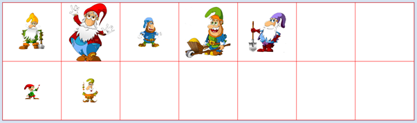
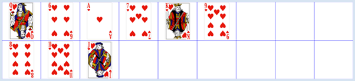

#################
Complexité de tri
#################

Introduction
============

Les ordinateurs sont bien davantage que de simples machines à calculer. On sait
par exemple qu’une proportion importante du temps processeur mondial est utilisé
pour trier des données pour y faire des recherches. De ce fait, il est crucial
pour un programme informatique de ne pas se contenter de livrer le résultat
correct mais encore de le faire de manière optimisée. L’optimisation d’un
programme touche principalement les aspects suivants :

    * Sa longueur
    * Sa structure et sa clarté (lisibilité)
    * Le temps CPU nécessaire à son exécution
    * Son utilisation de la mémoire de travail (RAM)

Fondamentalement, dans l’idéal, il faudrait toujours envisager l’optimisation du
code comme faisant partie intégrante de la conception du programme. Dans ce
chapitre, nous allons examiner l’optimisation du temps d’exécution d’un
algorithme de tri. Nous aborderons également les limites de l’informatique et
des ordinateurs au travers d’un exemple qui, bien que possédant certainement une
solution algorithmique, ne peut être résolu même à l’aide de l’ordinateur le
plus puissant de la planète. On parle alors de problème insoluble.

..  admonition:: Concepts de Programmation
    :class: tip

    * Complexité
    * Temps d’exécution
    * Ordre d’un algorithme
    * Méthodes de tri
    * Redéfinition d’opérateurs.

Trier comme des enfants (Tri par sélection)
========================================

Trier et réordonner un ensemble d’objets muni d'une **relation d'ordre** à
l’aide des opérateurs de comparaison plus grand que, plus petit que et égal
reste une tâche standard en informatique. Bien que tous les langages de
programmation mettent à disposition des bibliothèques de fonctions permettant
d’effectuer des tris, il est absolument indispensable d’inclure les concepts
théoriques du tri dans votre bagage informatique car vous rencontrerez toujours
des situations dans lesquelles il est nécessaire d’implémenter et optimiser son
propre algorithme de tri spécifique. On désigne par le terme « ensemble » une
collection d’objets non triés. Les objets sont stockés dans une structure de
données à une dimension. Les listes se prêtent à cet égard bien mieux que les
tableaux de longueur fixe utilisés jadis.

Le programme suivant illustre le tri à l’aide de petits lutins représentés à
l’écran par des acteurs de la bibliothèque de jeu ``JGameGrid``. On peut facilement
afficher leur image de sprite dans une grille. La hauteur de l’image
de sprite (en pixels) sert également de mesure de la taille du personnage.

    Visualisation du *selection sort* (tri comme les enfants)

Les algorithmes sont souvent inspirés directement de processus que nous
appliquons régulièrement dans notre vie de tous les jours. Si l’on demande à des
enfants d’expliquer comment ils procèdent pour trier un ensemble d’objets
d’après leur taille, ils décriront souvent le processus de la manière suivante : «
je prends le plus petit objet (ou le plus grand) et je le place tout à gauche ».
Cette façon de procéder semble tout-à-fait raisonnable mais présente un problème
pour l’ordinateur car celui-ci n’est pas capable de déterminer le plus grand ou
le plus petit objet en un coup d’œil. Afin de trouver le plus petit, il est
obligé de parcourir un à un tout l’ensemble d’objets et de tous les comparer
deux à deux. Pour être en mesure d’implémenter ce processus de tri, appelé en
l’occurrence *selection sort*, il faut une fonction ``getSmallest(row)`` qui retourne
le plus petit lutin de la liste examinée. On peut procéder comme suit.

On sauvegarde le premier élément de la liste dans la variable smallest et on
parcourt tous les éléments suivants dans une boucle ``for``. Si l’on tombe sur un
élément plus petit que celui temporairement enregistré dans la variable
``smallest``, on remplace ``smallest`` par celui-ci et on continue le parcours de la
liste.

Pour le *selection sort*, on utilise deux listes : la première, ``startList``, contient
les objets donnés et l’autre liste, ``targetList``, est initialement vide. On
recherche le plus petit élément de ``startList``, on l’en supprime et on le rajoute à
la fin de la liste targetList. On répète ce processus jusqu’à ce que ``startList``
soit vide.

..  code-block:: python
    :linenos:

    from gamegrid import *
    import random

    def bodyHeight(dwarf):
        return dwarf.getImage().getHeight()

    def updateGrid():
       removeAllActors()
       for i in range(len(startList)):
           addActor(startList[i], Location(i, 0))
       for i in range(len(targetList)):
           addActor(targetList[i], Location(i, 1))

    def getSmallest(li):
        global count
        smallest = li[0]
        for dwarf in li:
            count += 1
            if bodyHeight(dwarf) < bodyHeight(smallest):
                smallest = dwarf
        return smallest

    n = 7

    makeGameGrid(n, 2, 170, Color.red, False)
    setBgColor(Color.white)
    show()

    startList = []
    targetList = []

    for i in range(0 , n):
        dwarf = Actor("sprites/dwarf" + str(i) + ".png")
        startList.append(dwarf)
    random.shuffle(startList)
    updateGrid()
    setTitle("Selection Sort. Press <SPACE> to sort...")
    count = 0
    while not isDisposed() and len(startList) > 0:
        c = getKeyCodeWait()
        if c == 32:
            smallest = getSmallest(startList)
            targetList.append(smallest)
            startList.remove(smallest)
            count += 1
            setTitle("Count: " + str(count) + " <SPACE> for next step...")
            updateGrid()
    setTitle("Count: " + str(count) + " All done")

..  admonition:: Memento
    :class: warning

    L’algorithme du *selection sort* nécessite, en plus de la liste d’objets à trier
    de longueur :math:`n`, une seconde liste dont la longueur sera au bout du compte aussi
    de longueur :math:`n`. Si la taille de la liste à trier n est très grande, cela peut
    poser un sérieux problème de mémoire. Un algorithme de tri nécessitant, en plus de la structure de données à
    trier, d’une deuxième structure de données de même longueur, est appelé
    tri **ex situ** ou tri *out-of-place*. On évite généralement de tels
    algorithmes en raison de leur énorme consommation de mémoire de travail
    (mémoire RAM).

    On peut facilement déterminer le nombre d’opérations élémentaires nécessaires
    pour résoudre le problème : indépendamment de l’arrangement des objets dans la
    liste donnée, il faut forcément commencer par parcourir tous les :math:`n` éléments de
    la liste puis, lors du deuxième passage, :math:`n-1` éléments etc … De plus, il faut
    encore à chaque fois déplacer vers la liste destination le plus petit élément
    trouvé dans la liste à trier. Le nombre :math:`c` d’opérations nécessaires correspond
    donc à la somme de tous les entiers naturels compris entre :math:`2` et :math:`n + 1` comme le
    montre la variable count rajoutée à des fins de profilage. En utilisant la
    formule permettant de calculer la somme des nombres naturels, on obtient:

    ..  math::

        c = \frac{(n+1)\cdot (n+2)}{2} -1 = \frac{n^2}{2} - \frac{3n}{2}

    Par exemple, pour :math:`n = 1000`, il faut déjà un nombre colossal d’opérations:

    ..  math::

        c = \frac{1000^2}{2} - \frac{3\cdot 1000}{2} = 500'000 + 1500 \approx 500'000

    Comme vous le savez, le terme quadratique l’emporte pour de grandes valeurs de
    :math:`n`, ce qui explique que l’on dit que cet algorithme est de complexité quadratique
    en :math:`n`, ce que l’on note de la manière suivante :

    ..  math::

        \mathrm{Complexité\ de\ l'algorithme} = \mathcal{O}(n^2)

Trier le jeu de cartes (Tri par insertion)
==========================================

Lorsque l’on tient un jeu de cartes en éventail, on utilise souvent de manière
intuitive une autre méthode de tri : on insère chaque nouvelle carte obtenue
dans l’éventail à une position bien précise correspondant à sa valeur, de sorte
qu’elle soit triée par rapport aux cartes déjà présentes. Le programme suivant
procède exactement de la même manière lorsqu’il pioche une carte du tas et
l’insère dans la liste cible (la main) : Il prend les cartes une à une, de
gauche à droite, à partir de la liste de départ et parcourt toutes les cartes
déjà insérées dans la liste de destination. Dès qu’il rencontre une carte de la
liste de destination qui possède une valeur supérieure à la carte à placer, il
place la nouvelle carte juste avant cette dernière carte examinée.

    Visualisation du *insertion sort* (tri par insertion)

..  code-block:: python
    :linenos:

    from gamegrid import *
    import random

    def cardValue(card):
        return card.getImage().getHeight()

    def updateGrid():
       removeAllActors()
       for i in range(len(startList)):
           addActor(startList[i], Location(i, 0))
       for i in range(len(targetList)):
           addActor(targetList[i], Location(i, 1))

    n = 9

    makeGameGrid(n, 2, 130, Color.blue, False)
    setBgColor(Color.white)
    show()

    startList = []
    targetList = []

    for i in range(0 , 9):
        card = Actor("sprites/" + "hearts" + str(i) + ".png")
        startList.append(card)

    random.shuffle(startList)
    updateGrid()
    setTitle("Insertion Sort. Press <SPACE> to sort...")
    count = 0

    while not isDisposed() and len(startList) > 0:
        getBg().clear()
        c = getKeyCodeWait()
        if c == 32:
            pick = startList[0] # take first
            startList.remove(pick)
            i = 0
            while i < len(targetList) and cardValue(pick) > cardValue(targetList[i]):
                i += 1
                count += 1
            targetList.insert(i, pick)
            count += 1
            setTitle("Count: " + str(count) + " <SPACE> for next step...")
            updateGrid()
    setTitle("Count: " + str(count) + " All done")

..  admonition:: Memento
    :class: warning

    Cette méthode de tri est appelée tri par insertion (*insertion sort*). Le
    nombre d’opérations nécessaires dépend de l’ordre initial des cartes dans le
    tas. La situation qui demande le plus d’étapes survient lorsque le tas est
    malheureusement trié mais dans l’ordre inverse. On peut montrer, soit par
    une réflexion théorique soit en effectuant des simulations informatiques,
    que le nombre d’opérations élémentaires alors nécessaires pour effectuer un
    tri par insertion vaut en moyenne :math:`\frac{n^2}{4}` pour :math:`n` très
    grand. De ce fait, la complexité du tri par insertion est également en
    :math:`\mathcal{O}(n^2)`, comme pour le tri des enfants « *children sort* ».

Trie à bulles (Bubble sort)
===========================

Une façon assez connue de trier des objets d’une liste consiste à parcourir de
manière répétée cette liste de gauche à droite et d’échanger deux objets
adjacents qui sont dans le mauvais ordre. Avec cette méthode, c’est tout d’abord
le plus grand élément qui va remonter toute la liste de gauche à droite pour
aboutir en toute dernière position. Au prochain passage, on recommence le même
procédé tout à gauche de la liste en ne remontant cependant que jusqu’à
l’avant-dernière place puisque le plus grand élément est déjà bien placé. Ce tri
présente l’avantage de ne pas nécessiter de liste supplémentaire. [plus... ].

    Visualisation du *bublle sort* (tri à bulles)

..  code-block:: python
    :linenos:

    from gamegrid import *
    import random

    def bubbleSize(bubble):
        return bubble.getImage().getHeight()

    def updateGrid():
       removeAllActors()
       for i in range(len(li)):
           addActor(li[i], Location(i, 0))

    def exchange(i, j):
        temp = li[i]
        li[i] = li[j]
        li[j] = temp

    n = 7
    li = []

    makeGameGrid(n, 1, 150, Color.red, False)
    setBgColor(Color.white)
    show()
    for i in range(0 , n):
        bubble = Actor("sprites/bubble" + str(i) + ".png")
        li.append(bubble)
    random.shuffle(li)
    updateGrid()
    setTitle("Bubble Sort. Press <SPACE> for next step...")
    k = n - 1
    i = 0
    count = 0
    while not isDisposed() and k > 0:
        getBg().fillCell(Location(i, 0), makeColor("beige"))
        getBg().fillCell(Location(i + 1, 0), makeColor("beige"))
        refresh()
        c = getKeyCodeWait()
        if c == 32:
            count += 1
            bubble1 = li[i]
            bubble2 = li[i + 1]
            refresh()
            if bubbleSize(bubble1) > bubbleSize(bubble2):
                 exchange(i, i + 1)
                 setTitle("Last Action: Exchange. Count: " + str(count))
            else:
                 setTitle("Last Action: No Exchange. Count: " + str(count))
            getBg().clear()
            updateGrid()
            if i == k - 1:
                k = k - 1
                i = 0
            else:
                i += 1
    getBg().clear()
    refresh()
    setTitle("All done. Count: " + str(count))

..  admonition:: Memento
    :class: warning

    Le plus grand élément se déplace progressivement de la gauche de la liste vers
    sa droite, exactement comme le ferait une bulle dans un verre d’eau, de bas vers
    le haut. C’est pour cette raison que cette méthode s’appelle tri à bulles
    (bubble sort en anglais). Comme vous pouvez le voir par un raisonnement ou en
    examinant le compteur d’opérations intégré dans le programme, la complexité de
    cette méthode est indépendante de l’arrangement initial des éléments mais
    demeure en :math:`\mathcal{O}(n^2)`.

    Pour rendre la démonstration un peu plus attractive, les deux cellules dont les
    bulles viennent d’être comparées sont colorées avec la méthode ``fillCell()``. La
    couleur d’arrière-fond peut être nettoyée avec ``getBg().clear()``. Il est
    nécessaire d’invoquer la fonction ``refresh()`` pour faire en sorte que l’image soit
    réaffichée correctement à l’écran.

Tris à l'aide de la fonction intégrée : Timsort
===============================================

Du fait que le tri est un des algorithmes les plus importants, tous les langages
de programmation de haut niveau mettent à disposition des fonctions intégrées au
langage permettant d’effectuer des tris. En Python, il s’agit de la fonction
``sorted(list, cmp)`` qui fait même partie de la bibliothèque de fonctions
intégrées, de sorte qu’il n’est même pas nécessaire de l’importer avec ``import``.
Elle permet de s’économiser la tâche fastidieuse décrire un algorithme de tri.
Mais il faut tout de même comprendre comment cette fonction s’utilise. Elle
prend bien évidemment la liste à trier en paramètre. Le deuxième paramètre de la
fonction permet de préciser le critère à utiliser pour ordonner les objets.

Ce critère est défini au sein d’une fonction qui est appelée ``compare()`` dans
l’exemple ci-dessous. Cette fonction doit accepter deux objets en guise de
paramètres et retourner 1, 0, ou -1, suivant que le premier objet doit être
considéré respectivement comme étant supérieur, égal ou inférieur au second
objet. Cette fonction de comparaison au nom quelconque est ensuite passée en
deuxième paramètre de la fonction ``sorted``. Il est également possible d’utiliser
le paramètre nommé ``cmp``.

..  code-block:: python
    :linenos:

    from gamegrid import *
    import random

    def bodyHeight(dwarf):
        return dwarf.getImage().getHeight()

    def compare(dwarf1, dwarf2):
        if bodyHeight(dwarf1) < bodyHeight(dwarf2):
            return -1
        elif bodyHeight(dwarf1) > bodyHeight(dwarf2):
            return 1
        else:
            return 0

    def updateGrid():
       removeAllActors()
       for i in range(len(li)):
           addActor(li[i], Location(i, 0))

    n = 7
    li = []

    makeGameGrid(n, 1, 170, Color.red, False)
    setBgColor(Color.white)
    show()
    for i in range(0 , n):
        dwarf = Actor("sprites/dwarf" + str(i) + ".png")
        li.append(dwarf)
    random.shuffle(li)
    updateGrid()
    setTitle("Timsort. Press any key to get result...")
    getKeyCodeWait()
    li = sorted(li, cmp = compare)
    updateGrid()
    setTitle("All done.")

..  admonition:: Memento
    :class: warning

    Pour effectuer un tri à l’aide des fonctions prédéfinies dans une bibliothèque,
    il faut spécifier la manière dont les éléments doivent être comparés à l’aide
    d’une fonction de comparaison. Cela permet à la fonction sorted de déterminer si
    le premier élément d’une paire d’objets est supérieur, égal ou inférieur au
    second objet à comparer [plus... ].

    L’algorithme utilisé en Python a été inventé par Tim Peters en 2002 et s’appelle
    donc Timsort. Sa complexité est en moyenne en :math:`\mathcal{O}(n \log(n))`. De
    ce fait, lorsque :math:`n` vaut par exemple 106, il suffit d’environ 107 opérations
    pour trier la liste au lieu des 1012 opérations que demanderait un algorithme de
    tri quadratique en :math:`\mathcal{O}(n^2)`.

Exercices
=========

1.  Trier les 7 nains à l’aide d’un tri à bulles.

2.  Ajouter l’image de sprite ``snowwhite.png`` de Blanche Neige qui possède la
    même taille que le plus grand nain présent dans le tri à bulles de l’exercice 1.
    Montrer que l’ordre de Blanche Neige et du plus grand nain est toujours
    identique à l’ordre qu’ils avaient avant le début du tri. Un tel algorithme de
    tri est dit stable.

3.  Il est possible de générer une liste de nombres mélangés en créant une liste de
    nombres triés ``row = range(n)`` et en les mélangeant ensuite avec
    ``random.shuffle(row)``. Mesurer le temps d’exécution de l’algorithme intégré à
    Python (Timsort) pour différentes valeurs de n et montrer que sa complexité est
    bien meilleure que :math:`\mathcal{O}(n^2)`. Indication : Pour mesurer une
    différence de temps, il faut importer le module ``time`` et calculer la différence
    de temps qui s’est écoulée entre deux appels successifs à la fonction
    ``time.clock()``.

Matériel supplémentaire : redéfinir les opérations de comparaison
=======================================

La comparaison de deux objets constitue une opération très importante. Les
nombres admettent les cinq opérateurs de comparaison <, <=, ==, >, = >. En
Python, il est possible d’appliquer ces opérateurs de comparaison à d’autres
objets comme les nains par exemple, ce qui fait gagner au code en élégance et en
clarté. Voici comment procéder::

Dans la classe qui définit les objets à trier, il faut définir les méthodes
``__lt__()``, ``__le__()``, ``__eq__()``, ``__ge__()``, ``__gt__()`` qui
retournent la valeur booléenne de l’opérateur de comparaison correspondant à less,
less-and-equal, equal, greater-and-equal, greater.

De plus, il est également possible de redéfinir la méthode ``__str()__``, qui sera
automatiquement appelée par Python lorsque l’on veut convertir l’objet en chaine
de caractères avec la fonction ``str()``. Cela n’a cependant rien à voir avec le
tri.

Dans la classe ``Dwarf`` (dérivée de ``Actor``), on peut également stocker le nom du
nain dans une variable d’instance que l’on peut représenter à l’écran en tant
que ``TextActor`` lors de l’exécution de la fonction ``updateGrid()``.

..  code-block:: python
    :linenos:

    from gamegrid import *
    import random

    class Dwarf(Actor):
        def __init__(self, name, size):
            Actor.__init__(self, "sprites/dwarf" + str(size) + ".png")
            self.name = name
            self.size = size
        def __eq__(self, a):  # ==
            return self.size == a.size
        def __ne__(self, a): # !=
            return self.size != a.size
        def __gt__(self, a): # >
            return self.size > a.size
        def __lt__(self, a): # <
            return self.size < a.size
        def __ge__(self, a): # >=
            return self.size >= a.size
        def __le__(self, a): # <=
            return self.size <= a.size
        def __str__(self):  # str() function
            return self.name

    def compare(dwarf1, dwarf2):
        if dwarf1 < dwarf2:
            return -1
        elif dwarf1 > dwarf2:
            return 1
        else:
            return 0

    def updateGrid():
       removeAllActors()
       for i in range(len(row)):
           addActor(row[i], Location(i, 0))
           addActor(TextActor(str(row[i])), Location(i, 0))

    n = 7
    row = []
    names = ["Monday", "Tuesday", "Wednesday", "Thursday",
             "Friday", "Saturday", "Sunday"]

    makeGameGrid(n, 1, 170, Color.red, False)
    setBgColor(Color.white)
    show()
    for i in range(0 , n):
        dwarf = Dwarf(names[i], i)
        row.append(dwarf)
    random.shuffle(row)
    updateGrid()
    setTitle("Press any key to get result...")
    getKeyCodeWait()
    row = sorted(row, cmp = compare)
    updateGrid()
    setTitle("All done.")

..  admonition:: Memento
    :class: warning

L’usage d’opérateurs de comparaison personnalisés pour un type de données
arbitraire n’est pas obligatoire mais constitue une solution élégante pour
permettre d’en trier les instances. On dit que l’on a redéfini ou surchargé
l’opérateur (overloaded en anglais).
